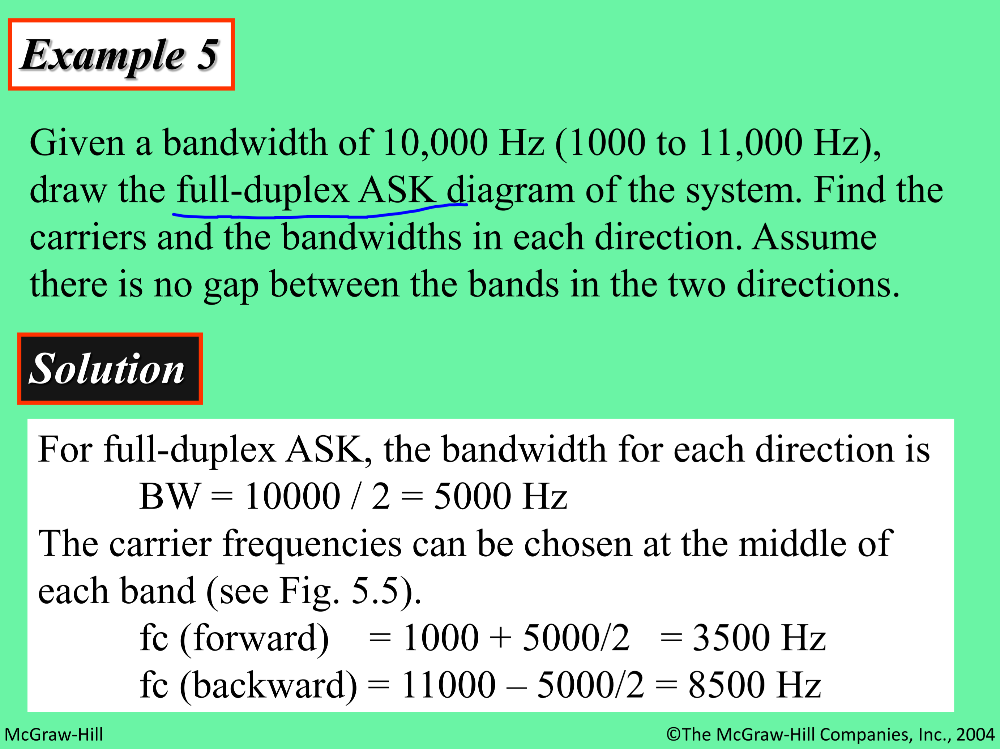
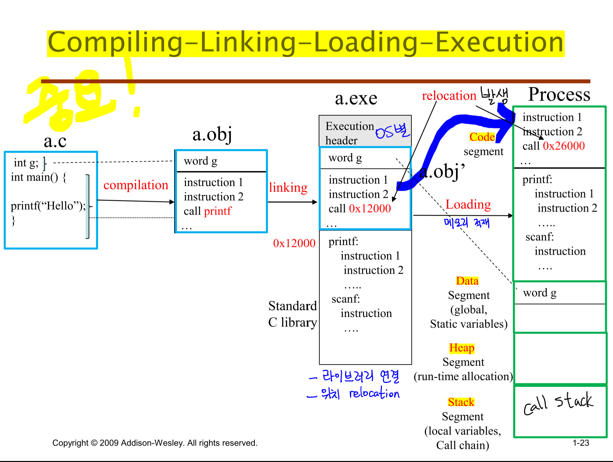
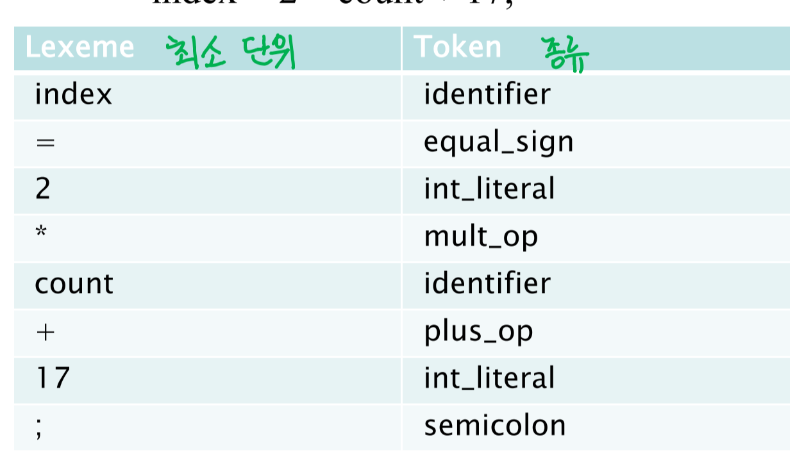
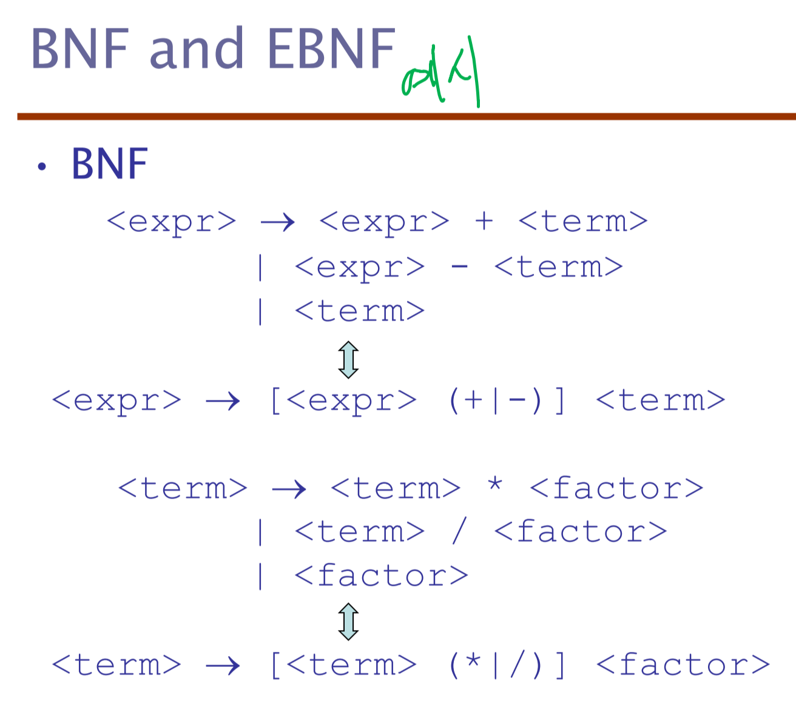
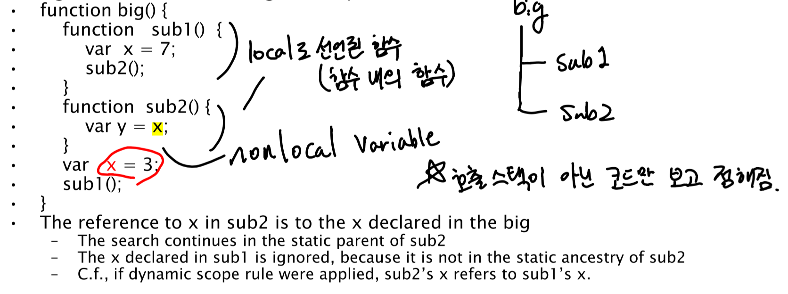
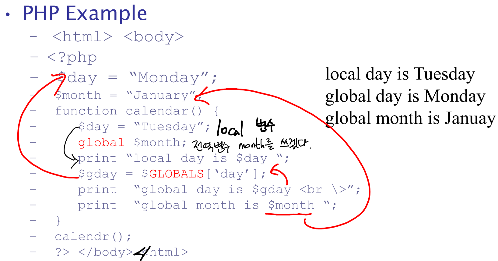
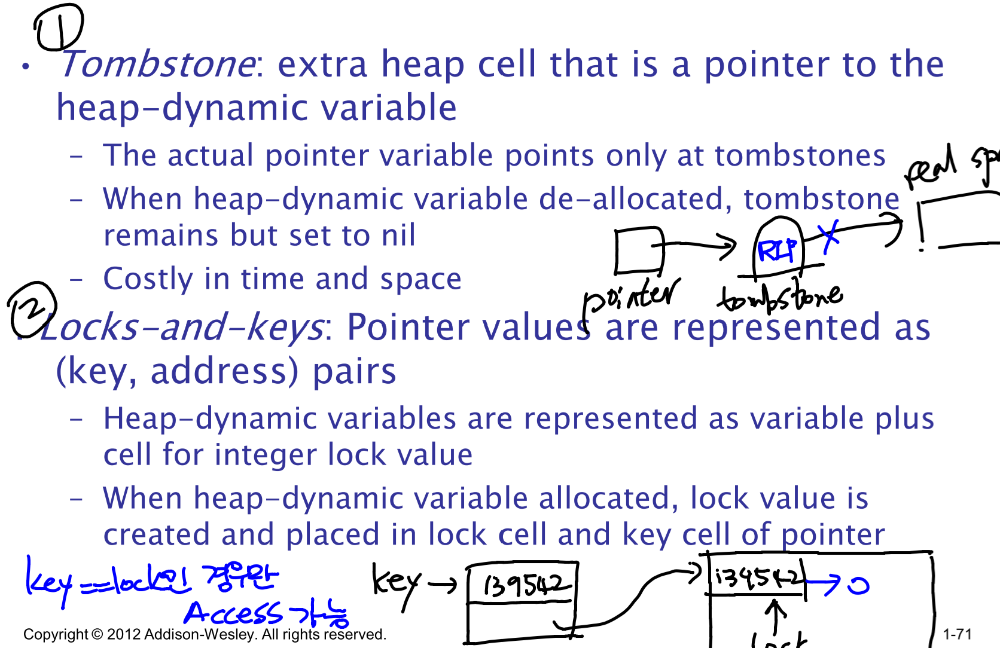

# Today I Learned (TIL)
## Since 2020.06.01 by DanielJung
### 원칙 1 : 주 2회 이상은 알고리즘 관련된 학습을 진행 후 작성  
## 2020.06.01 (Day 1)
- 컴파일러  
LR 구문 분석  
LL 구문 분석은 left-recursion 문제와 backtracking으로 인한 속도 문제로 인해 실제 컴파일러 사용하기엔 부적절  
따라서 위 2문제가 없는 LR 파싱을 주로 사용  
LR의 L은 Left-to-Right를 의미하며 R은 Rightmost derivation을 이용한다는 것을 의미한다.  
LR 구문분석방법으로는 SLR, CLR, LALR방법이 있다.

SLR 구문분석
SLR 구문분석은 LR(0) 항목과 FOLLOW를 이용하여 파싱표 작성 [파싱표 작성법 동영상](https://www.youtube.com/watch?v=ig-R03WwgLs)
1. Augmented grammar 생성(S' -> S)
2. LR(0) 항목 나열
GOTO(I<sub>0</sub>, symbol)의 경우 I<sub>0</sub>집합에서 symbol을 처리한 경우의 나오는 집합으로 I<sub>0</sub>에서 E 이후에 dot symbol을 위치한 후 CLOSURE를 계산한다.
새로 나오는 집합에 대해서는 I<sub>n</sub>으로 이름을 붙여주고, 새로운 집합이 나오지 않을 때까지 반복한다.
3. 모든 non-Terminal symbol에 대해 FOLLOW를 계산하여 나열한다.
4. SLR 파싱표의 GOTO표 부분은 symbol이 V<sub>N</sub>인 경우 몇번 집합으로 이동하는지 표시해준다.
5. 구문 분석기 행동의 경우  
reduce가 가능한(dot symbol이 마지막에 위치한 경우) reduce을 하며 E -> T인 경우 FOLLOW(E)의 항목들에 reduce작성하며 몇번 집합을 통해 reduce 되는지 표기한다.  
reduce가 불가능한 경우 shift하며 GOTO(상태, V<sub>T</sub>)의 집합 번호를 같이 기재한다.  
<u>1번 상태의 $는 항상 acc이다.</u>  
FOLLOW는 해당 symbol 다음에 나오는 모든 Terminal Symbol의 set이다.  

**<string>내일부터는 코드 작성 시작해야한다!</string>**  
- MarkDown Language  
header(제목) h1 ~ h6 '#'으로 표시 (예시: "###" h3)  
bold 는 **string** 으로 표시  
br대신 space 2칸으로 활용가능  
"[링크 표시될 제목] (링크)"
코드의 경우 ```로 코드 종류 명시 후 감싸주기  
인용문의 경우 > 이용
## 2020.06.02 (Day 2)
- Dijkstra Algorithm  
오랜만에 다익스트라 알고리즘 문제를 접하게 되었다. 작년에는 한참 종만북을 보며 연습했었는데, 아무런 공부없이 문제를 맞딱드리게 되니 머릿속이 하얘졌다.  
리트머스 문제를 풀기 위해서 psuedo code를 보기도 하였으나 기존의 이용했던 코드와 달라 작성하기 힘들었다.  
~~물론 문제에 오류가 있어서 시간을 모두 사용했다.~~  

다익스트라가 나온김에 한번 대표적인 문제의 코드를 보자.  
vector와 priority_queue를 이용해야 가장 효율적이다.
```cpp
#include<iostream>
#include<vector>
#include<queue>
#define INF 1e9
using namespace std;
 
int main()
{
    int V,E;
    scanf("%d %d", &V ,&E); //노드의 갯수와 엣지의 갯수를 입력받습니다. 
    int start;
    scanf("%d",&start);        //시작점을 입력받습니다. 
    vector<pair<int,int> > arr[V+1];
    
    for(int i=0;i<E;i++){
        int from,to,val;
        scanf("%d %d %d", &from , &to,&val); //그래프 상의 엣지들에 대한 정보를 입력받습니다. 
        arr[from].push_back({to,val});
    }
    int dist[V+1];    //최단거리를 갱신해주는 배열입니다. 
    fill(dist,dist+V+1,INF);    //먼저 무한대로 전부 초기화를 시켜둡니다. 
    priority_queue<pair<int,int> > qu;     
    
    qu.push({0,start});    //우선순위 큐에 시작점을 넣어줍니다. 
    dist[start]=0;    //시작점의 최단거리를 갱신합니다. 
    
    while(!qu.empty()){
        int cost=-qu.top().first;    // cost는 다음 방문할 점의 dist값을 뜻합니다. 
        int here=qu.top().second;     // here을 방문할 점의 번호를 뜻합니다 
        
        qu.pop();
            
        for(int i=0; i<arr[here].size(); i++){
            int next=arr[here][i].first;
            int nextcost=arr[here][i].second;
            
            if(dist[next] > dist[here] + nextcost){    
                //현재 next에 저장된 dist의값보다 현재의 점을 거쳐서 갈 경우가 
                // 거리가 더짧으면 갱신해 주고 큐에 넣습니다. 
                dist[next]=dist[here]+nextcost;
                qu.push({-dist[next],next});
            }
        }
        
    }
    for(int i=1;i<=V;i++){
        printf("%d\n", dist[i]);
    }
}
 ```

 - 컴파일러  
 C로 작성된 first, follow 코드는 찾았으나,  
  이를 C++로 수정해야하고 파일 입출력도 넣어야하지만 하지 못했다....  
  내일은 제대로 집중해서 컴파일러에만 시간을 할애해야겠다.

## 2020.06.03 (Day 3)
오늘은 하루종일 컴파일러에 집중했다.
- 컴파일러  
파일입출력을 통해 문법을 입력받고, 주어진 문법의 V<sub>N</sub>의 First와 Follow를 계산하여 출력하는 작업을 하였다. 물론 First와 Follow는 처음부터 구현은 힘들어 github의 다른 코드를 참조하였다.  
파일입출력은 ``ifstream``을 통해 작업하였으며, ``getline`` 을 사용하였다.  
```cpp
ifstream syntax;
syntax.open("syntax.txt");
if(syntax.is_open()) {
    while(!syntax.eof()) {
        syntax.getline(char[]name, maxlength); //주의할 점은 name은 char형만 가능
    }
}
```
또한 기존 코드에 처리되어있지 않은 2가지의 문법을 or로 구분하여 작성되어 있는 문법을 처리하였다.
> **from** (ex. A ==> B || C)  
> **to** (A ==> B) & (A == > C)

위 문장은 2개의 문장으로 분할하여 production rule에 추가하였다.  
SLR parser를 구현하기 위해서는 앞으로 ``CLOSURE``와 ``GOTO`` 함수 구현이 필요하다.  
오늘은 증가문법 (augmented grammar)는 완성하였다.  
현재 파서는 인덱스 구조로 되어있기 때문에 복잡한 문법은 처리하지 못한다. 특히나 터미널 심볼이 두 문자 이상으로 구성되어 있는 경우 처리하지 못하기 때문에 문제가 크다.  
앞으로 해결해야할 문제이다.

## 2020.06.05 (Day 4)
- OS / Main memory   
Memory allocation method에 대해 알아보았다. 그 중 아래 3가지에 대해 자세히 알아보았다.  
1. Contiguous Allocation
1. Segmentation  
1. Paging
>주로 메모리 할당에 관련해서는 2가지 항목을 평가한다.  
**Utilization(활용도) & Performance(Address Translation 소요 시간)**  

``Contiguous``는 가장 효율적이지 못한 allocation policy이다.  
연속적으로 무조건 할당해야하므로 Internal & External fragmentation이 매우 크다.  
또한 swap이 발생한 경우 유일하게 뛰어난 Performance도 저하된다.<br>

그렇기 때문에 나온 것이 ``Segmentation``이다. 이는 Logical Address Space를 분할해 메모리에 로드 할 수 있도록 한 것인데, 이러한 프로그래밍 방식을 개발자들이 이용하지 않아 사양됬다. 또한 Address Translation에 오랜 시간이 걸린다.  
<br>
다시 한번 개선된 것이 현재에도 쓰이는 ``Paging`` 기법이다.  
그러나 해당 기법에는 문제점이 있다.  
Page Table을 참조하기 위해 Memory에 2번 Access해야 하는 문제가 생긴다.  
이는 TLB Cache를 이용하여 해결한다. TLB hit ratio가 충분히 보장되는 경우 성능 저하가 거의 발생하지 않고  
Utilitzation은 page table을 hieraricial page table을 구성하여 높일 수 있다.  

- OS / Virtual memory  

Virtual Memory는 기존에 프로세스에서 요구하는 100%의 page에 frame을 할당해 관리하는 것이 아니라 일부 필요한 부분에 할당을 하여 **utilitzation을 극대화** 할 수 있는 방법이다.  
이를 위해서는 LAS와 PAS 사이에 Virtual Address Space를 이용한다.

로드된 이외의 영역은 storage device인 backing store에 저장한다.  
로드되지 않은 메모리 영역의 page를 요청하면 **page fault**가 발생하며 swap영역 또한 program image의 데이터를 가지고 온다.  물리 메모리가 부족한 경우 현재 잘 사용되지 않는 page를 골라(고르고 교체하는 작업을 수행) page replacement를 실시한다.

page replacement policy는 demand paging(페이지가 필요한 경우 즉각 로드하는) 사용 시 ``Belady's Anomaly``를 볼 경우 중요하다는 것을 알 수 있다.  
(크키가 커져도 page replace가 제대로 안되면 page fault 발생 횟수가 증가)  

이를 해결하기 위해 LRU Approximation Algorithm을 이용한다.
Enhanced Second-Chance Algorithm이 최신의 기술이다.

> Take ordered pair (reference, modify) 
>1. (0, 0) neither recently used not modified – best page to replace
>2. (0, 1) not recently used but modified – not quite as good, must write out before replacement 
>3. (1, 0) recently used but clean – probably will be used again soon
>4. (1, 1) recently used and modified – probably will be used again soon and need to write out before replacement

위 작업을 통해 circular queue를 이용해 문제를 해결한다.

## 2020.06.07 (Day 5)
- Data Communication 정리  
    1. Network Models  
        >5 계층 인터넷 모델에선 **Transport : TCP / Network : IP**만 사용하면 전부 Interntet이다.  
        
        각 계층별 역할을 살펴보자  
        - *물리 계층(Physical layer)* : 개별 비트를 인접 노드에 전달하는 역할, 선로의 물리적 특성과 전송방식을 다룸  
        - *데이터 링크 계층(Data Link layer)* : 안정적인 Next-hop deilivery 역할을 함. 데이터를 Frame 단위로 전송하는 Framing, Physical Addressing(MAC 주소) 등등. 현재는 주로 Ethernet을 기반으로 함  
        - *네트워크 계층(Network layer)* : Source-to-Destination 전송을 책임. 서로 다른 네트워크 간 전송도 책임(Routing). 현재는 주로 IP 프로토콜 이용.
        - *전송 계층(Transport layer)* : Process-to-Process delivery를 책임. 주로 port addressing 작업에 이용
        - *응용 계층(Application layer)* : 어떠한 서비스의 어떤 프로토콜을 이용해 전송할 것인지 결정. 사용자에게 서비스를 제공.
    
    1. Signals & Transmission  
        data가 전송되기 위해선 전자기적 신호로 변환이 되어야한다.  
        데이터 통신에서는 주로 **주기적 아날로그 신호(periodic analog signal)과 비주기적 디지털 신호(aperiodic digital signal)**을 사용한다.  <br><br>
        - Analog Signal  
            *Fourier transform* : **any composite signal => a combination of simple sine waves** with different freq, phase, and amplitude  
            ex) Square wave = 무한히 많은 Sine wave를 반복하면 만들어낼 수 있다.  
            그러나 medium에 따라 일부 주파수만 통과시키면 변형이 될 수 있다.

            **BandWidth** : medium이 정상적으로(출력의 half 이상 손실 없이) 통과시켜줄 수 있는 주파수 범위 (highest - lowest)
            
            따라서 Analog Signal을 확인할 때는 아래 2가지를 확인해야함
            > 1. Medium Bandwidth가 전송하려는 Signal의 Bandwidth보다 크거나 같은지
            > 2. Medium이 통과시키는 주파수가 Signal의 주파수 범위에 맞는지  
        - Digital Signal  
            Analog에서의 period = Bit interval, freq = Bit rate  <br>
            Digital Signal은 기본적으로 infinite frequency를 가짐  
            따라서 Digital Signal 원본을 송수신하기 위해선 Wide-Band medium이 필요하지만 가격이 비쌈  
            ``Nyquist therom``과 ``Shannon capacity``에 따르면 band limited medium에도 전송이 가능하다.

            >Nyquist Therom  
            **Medium BandWidth >= (number of bps) / 2**  
            단 1비트가 아닌 n비트를 신호 하나에 실어 보낼 경우 bps는 증가가능  

        - Analog transmission vs. Digital transmission  
            
            - low-pass channel : 특정 freq. 0 이상 f 이하의 bandwidth를 가지는 channel
            - band-pass channel : 특정 freq f<sub>1</sub> ~ f<sub>2</sub>의 bandwidth를 가지는 channel    

        **Digital transmission은** Digital signal을 전송하므로 이론적으로 0 ~ infinity의 대역폭(bandwidth)가 필요하므로 **low-pass channel이 필요함**  

        반면에 **Analog Transmission은 low 또는 band-pass에서 사용가능** 또한 **B/W 대역을 쪼갤 수 있음**  

        - Noiseless channel => ``Nyquist Therom``  
        > Bitrate in bps = 2 * Bandwidth * log<sub>2</sub>L  
        L : numbers of signal levels  

        - Noisy channel => ``Shannon capcity``  
        > *Capacity* in bps  = bandwidth * log<sub>2</sub>(1+SNR)  
        SNR : Power<sub>signal</sub> / Power<sub>noise</sub>

        **Channel Capacity보다 data rate를 높게 설정하는 것은 불가능하다.**

    1. Transmission Impairment(손상)  
        - Attentuation(감쇠) : medium의 저항으로 인해 손실되는 에너지 / amplifier를 통해 해결  
        dB = 10log<sub>10</sub>(P<sub>2</sub>/P<sub>1</sub>)  
        +이면 에너지 증폭, -이면 에너지 감쇠 / 단순 덧셈, 뺄셈 가능
        - Distortion(왜곡) : 각각의 signal은 전파 지연 속도가 다르기 때문에 신호가 왜곡될 수 있음
        - Noise(잡음) : 온도, 충격, 누화(crosstalk), 전기적 충격에 의해 신호가 손상될 수 있음  

    1. Digital Transmission  
        binary data => digital signal 변환하는 과정을 Line Coding이라고 함  
        - Signal Level & Data Level
            - Signal Level : signal에서 구분할 수 있는 단계 수
            - Data Level : data에서 구분할 수 있는 단계 수
        - Pulse rate & Bit rate
            - Pulse : symbol 하나를 전송하는데 걸리는 최소 시간
            - pulse rate : 초당 pulse의 전송 개수
            - bit rate = pulse rate * log<sub>2</sub>L  
            L : number of data levels
        - DC components : Amplitude가 순간적으로 0이 되는 순간을 신호로서 표현할 수 signal  
        추가 에너지를 필요로 하기 때문에 구현이 쉽지 않음

        - Self-syncrhonization(비동기)  
        
            - Unipolar encoding : 1개의 voltage level을 이용하여 간단하지만, dc componet 문제와 동기화할 수 없다는 점이 단점이다.
            - Polar encoding : 2개의 voltage level(+/-, signal level)을 써 dc component는 없지만, 동기화 문제 존재
                - NRZ-L : data 0은 positive voltage, 1은 negative voltage를 송수신  
                반복된 0 또는 1 data는 동기화 문제를 유발시킨다.
                - NRZ-I : data 0은 기존 전압 유지, 1은 전압 반대로 전환  
                NRZ-L보다 나은 동기화 성능
                - RZ : data에 맞는 신호를 보낸 후 0 voltage로 항상 전환하여 syncronization을 실시  
                단, 잦은 phase 변화로 frequncy 증가 -> 많은 bandwidth 소모 
                - Manchester : RZ에서 0 voltage 대신 중간 voltage transition을 이용해 b/w 절약
                - Differential Manchester : Manchester 방식에 NRZ-I 방식을 합함. data가 0이면 transition, 1이면 no transition이다.
            - Bipolar encoding : 3개의 Signal Level을 가짐
                - AMI : 1에서만 signal inverse  
                NRZ-L과 같은 단점 존재
                - BnZS : 다르게 인코딩한다... ~~자세한 설명은 없었음~~
            - 2B1Q : 2개의 비트, 4개의 signal level
            - MLT-3 : NRZ-I와 동일하지만, 3개의 signal level 사용
        - Block Coding : 전송 비트를 나눠서 블록 단위로 syncronization 문제 발생하지 않는 비트로 매핑
            - 4B/5B : 4bit를 5bit로 인코딩, 앞에는 0이 최대 1개, 뒤에는 0이 최대 2개만 중복함으로서 3개 이상의 0은 연속되지 않도록 함
            - 8B/10B : 8bit를 10bit로
            - 8B/6T : 8bit를 3개의 signal level을 가진 6개의 signal 3<sup>6</sup>로
        - **Analog data를 Digital 전송하기 위해서는 data sampling이 필요**
        - 이후 내용은 내일 이어서...
## 2020.06.08 (Day 6)
- data communication 정리 (cont.)  
    1. digital transmission
    - sampling
        - PAM(Pulse Amplitude Modulation) : analog data의 파형을 그대로 digital로 따라한 것
        - PCM(Pulse Code Modulation)  
            PAM => **Quantization** => binary encoding => line coding  
            <u>**sampling rate는 원래 신호의 최대 주파수의 2배 이상으로 해야한다!**</u>  
            band-pass signal을 low-pass signal로 변환하여 sampling 할 경우 signal bandwidth의 2배를 sampling rate로 잡으면 된다.  
            각 sample 당 필요한 bit 수는 ceiling(log<sub>2</sub>N)개 이다.  
            따라서 bit rate = sampling rate * number of bits per sample
    - Transmission mode
        - Parallel
            : 고속이나 선로 부담이 커 비용이 비쌈, 주로 짧은 거리에 이용  
        - Serial 
            : 동기시스템과 비동기시스템으로 나뉜다. 
            - 비동기 시스템은 신호의 시기나 순서가 중요하지 않은 시스템. 시작비트, 종료비트로 바이트 단위를 구분해 전송. 저렴하며 효율적이지만 느리다.
            - 동기 시스템은 바이트 단위 구분 없이 전송한다. 따라서 바이트 단위의 순서가 중요하다.  

    2. Analog transmission
        - Terminology
            - modulation : digital/analog data -> band-pass analog signal
            - baud : signal unit / baud rate : # of signal units per second
            - carrier signal : 기준 주파수 (+ 유저의 데이터를 추가하여 전송)
        - ASK(Amplitude Shift Keying)
        : 단순히 신호의 세기를 변조해 데이터의 0/1을 표시하는 방법  
        b/w = baud rate와 동일한 만큼 필요(f-N<sub>baud</sub>/2 ~ f+N<sub>baud</sub>/2)  
        ASK에선 baud rate와 bit rate가 동일  
        단순하지만 noise에 약함
        
        ASK full-duplex 문제 참고.

        - FSK(Frequency Shift Keying)
        : 2개의 주파수를 이용해 주파수에 각 0, 1을 할당하여 변조하는 방법  
        FSK에 특별히 적합한 주파수가 존재  
        b/w = f<sub>c1</sub> - f<sub>c2</sub> + N<sub>baud</sub>(baud-rate)  
        FSK에서도 baud rate와 bit rate가 동일

        - PSK(Phase Shift Keying)
        : signal의 phase에 따라 데이터를 변조하는 방법  
        Minimum b/w = N<sub>baud</sub>  
        PSK의 경우 baud rate와 bit rate가 동일하지 않을수도 있음으로 유의 **(2<sup>1baud to bit</sup>-PSK)**  

        - QAM(Quadrature Amplitude Modulation)  
        : ASK + PSK 방식  
        PSK와 동일하게  **(2<sup>1baud to bit</sup>-QAM)**으로 표기

        - Modulation of analog signal
            1. AM : total required b/w = audio signal * 2
            2. FM : total required b/w = audio signal * 10
        

## 2020.06.18 (Day 7) : PL summary
1. chapter 1 Preliminaries
    - Programming Domains
        - Scientific application : Fotran - 많은 수의 부동소수점 계산과 배열 활용
        - Business application : COBOL - 레포트 작성, 십진수와 문자 사용
        - Artificial application : LISP - 숫자 조작보다는 기호를 이용, 링크드 리스트의 활용
        - System programming : C - 지속적 사용으로 인한 효율성 극대화 필요
        - Web software : HTML, PHP, Java - 호환성 필요
    - Language Evaluation criteria
        - ``Readability`` : 가독성, 간단하고 직교성(적은 수의 구조체를 가지고 프로그래밍)을 가지는 지, 적절한 data types를 가지고 있는지
        - ``Writability`` : 표현성 (가독성과 마찬가지로 약간 주관적), 추상화에 대한 지원이 있는지, 표현이 얼마나 편리한지
        - ``Reliability`` : 신뢰성, language가 **typesafe** 한지 여부가 대표적, exception handling과 aliasing 지원 여부
        - ``Cost`` : 컴파일러 실행 시간 + 실행 속도 + 유지보수 비용 + ... 다양한 시간, 비용 계산
    - Language Design : *사람이 변화할 때, 컴퓨터 구조가 변화할 때, 함께 변화한다.*
        - 대부분의 컴퓨터 언어의 구조는 폰 노이만 구조의 영향을 크게 받음
        - 명령형 언어의 기반 : 변수 => 메모리 셀 매핑, assignment statement, iteration에 강함
    - Programming methodology
        - 1950s ~ early 1960s : H/W인 기기의 효율성을 중시 - 어셈블리어
        - late 1960s : 사람의 효율성을 점차 중시하게 되며 가독성, 더 나은 control structure 를 원하게 됨. 구조화된 프로그래밍, top-down 방식의 디자인의 등장
        - late 1970s: data-oreiented 로 변화를 시도하였으나 실패
        - Middle 1980s : object-oriented   
        **data abstraction + inheritance + polymorphism**
    - language categories
        1. Imperative - 폰 노이만 구조 기반 : C, Java, Perl, JS, C++...
        1. Functional - lambda function을 이용한 구조 : LISP, Scheme
        1. Logic - expert system 개발에 이용, 현재 사용되지 않음 : prolog
        1. Markup & hybrid - 다른 프로그램을 지원하기 위한 language : JSTL, XSLT
    - Implementaion methods
        - Compilation : 컴파일 방식 (속도 ↑, 개발기간 ↑)
        - Pure Interpretation : 인터프리터 방식 (속도 ↓, 개발기간 ↓)
        - Hybrid 방식 : compilation + interpretation
    - Compilation : **Slow translation, Fast execution**
        - Load module : 운영체제나 기능이 미미한 경우 system code와 user code를 한번에 load함
        
    - Von Neumann Bottleneck : CPU와 Memory 사이의 bottleneck 현상
    - Pure Interpretation : **Easier implementation, Slower execution**  
    No translation, Often requires more space
    - Hybrid Implementation system : compilation + pure interpretation
    - Just-in-Time Implementation System  
    Java -> bytecode 는 interpretation 방식으로 즉시 변환하고, bytecode -> machine language는 호출 시 컴파일  
    1회 컴파일, 실행 시 해당 machine code는 저장(이후의 호출 시 이용) 
2. chapter 3 Syntax and Semantics
    - Syntax : expression, statement의 구조나 형태
    - Semantics : Syntax가 가지는 실질적인 의미
    - Lexeme & Token 

## 2020.06.19 (Day 8) : PL Summary(cont.)
- BNF 문법은 Context-Free grammar를 전부 표현 가능  
    LHS : non-terminal => RHS : terminal & non-terminal  
    non-terminal은 <> 안에 둘러쌓여서 표현  
    ex) <ident_list> -> ident | ident, <ident_list>  
    sentential form : terminal symbol로만 이루어진 sentence가 되기 이전까지의 과정
    - 같은 문법에 대해 다른 parse tree가 발생하면 모호한(ambiguous)한 문법
    - 따라서 우선순위(precedence)와 결합법칙(associativity)를 이용
    - 우선순위를 통한 분리방법
        1. 우선순위가 낮은 연산자가 먼저 나오도록 한다.
        1.  | <term> 을 이용해 보다 높은 우선순위의 연산자를 재 기술
        1. <term> -> 높은 순위 연산자 기술
- **EBNF 표기법**
    > "[ ]"기호는 생략가능한 부분  
    > "(+/-)" 와 같은 기호는 기호들 중 택해야 함  
    > "{ }" 는 0회 이상 반복되는 부분(생략도 가능) 


3. Chapter 4 Lexical & Syntax analysis
    - Regular grammar => Regualr expression => Finite-state machine(FSM)
    - Context-free grammar => BNF => push-down automata

4. Chapter 5 Names, Bindings, Scopes
    - *메모리 주소에 대한 언어에서의 추상화 방식은 **변수***를 이용하는 것이다.
    - 6가지 sextuple로 변수의 특성을 설명할 수 있다.
    1. Names : 변수의 특성 중 근본적인 속성 한가지 이다. 함수, 인자와 연관되어있음
        - 주요 디자인 이슈 : **Case sensitive(대소문자 구별), reserved words, keywords**
        - 형태 : Camel notation을 많이 사용(ex. ScoreValue) 앞글자를 대문자로
        - Case-sensitivity / Special words : 필요는 하나 너무 많으면 문제
    1. Address : *aliases*는 같은 메모리 주소를 가르키지만 다른 이름을 가진 별칭
    1. Type : 변수 값의 범위와 연산
    1. Value : l-value 는 address, r-value는 value를 의미
    1. Lifetime
        > Binding : entity와 attribute 사이의 연결
        - *binding이 발생하는 시간에 따라 Static, Dynamic binding이 존재*
        - <u>언어 디자인, 구현, 컴파일 타임</u>에 바인딩 되어 있는 것을 **Static binding**
        - <u>프로그램 로드 시, 런타임</u>에 바인딩 되는 것을 **Dynamic binding**
            
        - Static Binding  
        <sup>1</sup>실행(runtime) 이전에 바인딩이 완료되며, <sup>2</sup>실행되는 동안 바인딩이 변경되지 않음 
        - Dynamic Binding  
        <sup>1</sup>Compile time 이후에 바인딩되거나, <sup>2</sup>프로그램 runtime에 binding이 변경됨
        - Type binding : 변수를 사용하기 이전에 필수적으로 data type에 대한 binding이 되어있어야한다.
            - type 지정 방법
                - static type binding : 선언 시 type이 지정됨
                    - explicit(명시적) 방법 : data type을 직접 명시함(ex. int, char)
                    - implicit(묵시적 방법)
                        - naming convention : type별 변수 이름의 규칙이 지정되어있음
                        - context : 문맥을 보고 compiler가 data type을 유추
                - dynamic type binding : 할당 시 binding
                    - 변수에는 특별히 지정된 data type이 있는 것이 아님
                    - 선언 시 상황에 맞게 매핑됨
                    - *단점으로는 type checking이 불가능하고, H/W resource를 많이 차지*

        - Storage bindings & **Lifetime**
            - 전체적인 속도 : static < heap = stack
            - Static
                - bind storage before execution
                - 프로그램 <u>실행 동안에는 계속 같은 공간에 bound</u>
            - Stack-dynamic
                - variable이 declare 될 때 stack에 할당
                - 몇몇 언어는 subprogram의 처음이 아니여도 declare 가능
                - 간혹 성능 최적화를 위해 변수 선언이 subprogram 처음으로 이동하기도 하지만, 무조건적으로 올려서는 안됨
                - 장점
                    1. **recursion이 가능하다.** (매우 큰 장점)
                - 단점
                    1. *allocation과 deallocation에 overhead가 발생한다.(속도 ↓)*
                    1. subprogram이 histoy sensitive하지 못하다.
                    1. indirect addressing으로 인해 reference가 비효율적이다.
            - explicit heap-dynamic
                - <u>명시적으로</u> 개발자가 연산자, 시스템 콜 호출을 통해 **heap영역**에 데이터를 생성
                - 장점 : 동적 공간 할당과 관리를 제공해준다.
                - 단점
                    1. pointer와 reference를 통해 관리하는데 어려움이 발생
                    1. 변수의 reference로 인한 비용이 든다. 
                    1. storage management를 구현하기 위한 복잡성이 증가한다.
            - implicit heap-dynamic
                - assignment statement를 만나는 순간 allocation과 deallocation이 동시에 일어난다.
                - 이전에 해당 변수가 어떠한 type이였는지는 관여하지 않는다.
                - 장점 : 가장 높은 flexibility 제공
                - 단점
                    1. dynamic attributes를 유지하기 위한 runtime overhead 발생 (속도 ↓)
                    1. error detection이 불가능하다. (realiability ↓)
    1. Scope
        - local variable : program unit내에 선언된 변수
        - nonlocal variable : program unit내에서 참조할 수는 있으나 외부에서 선언된 변수
        - Global variable : nonlocal variable중에 하나  

        - **Static scope** : <u>compile time에 nonlocal 변수의 reference 위치를 결정할 수 있음</u>
            - static scoped language
            - subprogram이 nested가 가능한 경우 : 실행속도 ↓, 제약 없음
            - subprogram이 nested가 불가능한 경우 : 실행속도 ↑, 제약 존재
            - 호출 스택이 아닌 코드만 보고 가장 가까운 static ancestor를 찾아 참조한다.
             ***이 그림 꼭 확인하기!!***
            - 같은 이름을 가질 경우 더 가까운 변수가 선택된다.
            - 대부분의 functional language는 `let`을 이용해 imperative language의 block를 의미한다.
            - C99, C++, Java, C#은 선언 시점부터 block의 끝까지 변수를 이용할 수 있다.
            - Global scope (global variables)
                - declaration : function prototype
                - definition : attribute and storage
                - C/C++ 에서는 `extern`을 이용해 외부의 전역변수를 이용 
                - PHP 에서는 그림 참조 
                - Python 에서 read는 가능, write는 `extern`과 마찬가지로 `global` 사용해서 선언해줘야 가능 (전방참조 주의!)
        - ***Static scope 방식은 대부분의 경우에 잘 작동하나, 구현시 오버헤드가 크다.(enclosed scope)***
        - ***Dynamic scope : nonlocal 변수의 reference 위치를 코드로는 알 수 없고 실행시 call-chain을 통해 알게 됨(all active subprogram)***  

        <u>**Static-scoped language와 Dynamic-scoped language의 차이점 매우 중요!**</u>
        - Scope != Lifetime (ex. `static` variable)
        - Named Constant : 1회 storage binding만 가능한 형태 (가독성이 뛰어나짐)
            - dynamic bound : expression 전체가 RHS에 가능
            - statically bound : 숫자 & named constant로 구성된 RHS가 가능  

5. Chapter 6. Data Types <sup>1.</sup>data representation <sup>2.</sup>operation
    - Primitive Data Types (기본 데이터 타입)
        - 몇몇은 하드웨어의 반영결과이다.(ex. integer types)
        - 다른 structered type를 정의하는데 사용
        - Integer
            - representation : H/W mapping 상태(표현과 저장방식 동일)
            - operation : Two's complement
        - Floating point
            - 지수부(exponent)와 가수부(fraction) 부분으로 나눠서 사용
        - String
            - pattern matching 연산(Perl 지원)
            - C/C++에서는 non-primitive / Java, C#, Ruby, Perl.. 등 대부분에서 primitive 한 data
            - 특히, Perl, JS, Ruby, PHP에서는 regular expression을 지원
            - 문자열의 길이 지정
                - static : 정적
                - limited dynamic : static 방식이나 내부적으로 복사 작업을 통해 유지
                - dynamic : 완전히 동적인 방식으로 길이에 대한 제한이 전혀 없음

## 2020.06.20 (Day 9)
- Enumeration Types
    - 주요 디자인 이슈
        - 서로 다른 enum type에서 같은 이름을 사용할 수 있느냐?
        - enum value가 정수에 매핑되느냐?
        - 열거형으로 작성하도록 제한된 유형이 있느냐?
        - 코드의 **가독성과 신뢰성이 높아짐**, 그러나 코드 작성은 어려워짐(길어지고, 지루함)
- Array types
    - homogeneous(동일)한 여러개의 데이터를 집적시켜 놓은 형태
    - 주요 디자인 이슈
        - array의 index(subscript)에 적절한 타입은 무엇인가
        - subscript expression의 range check를 실시하느냐
    - Array indexing
        - 몇몇 언어에서는 괄호(parentheses)를 이용
        - 대부분은 bracket `[]`을 이용
        - Ada : subscript type으로 enumeration type을 사용
        - Java, ML, C#은 range check 진행
        - Perl의 경우 독특
        ```pl
            @signs = (0, 1, 2 ,3, 4); // 선언
            $signs[2]; // 3번째 원소 접근
            $signs[-2]; // $signs[3]과 동일
        ```
        - lower bound(인덱스 시작값)은 지정할 수 있는 경우도 있음  
    - Array categories
        - static array : data segment에 array 할당 / subscript range와 storage 할당이 static하게 이루어짐
        - *fixed stack-dynamic array* : stack segment에 고정 크기로 할당 /  
            <u>subscript range는 static하게, array storage allocation은 execution time에 **stack**에 할당</u>
        - *fixed heap-dynamic array* : heap segment에 고정 크기로 할당 /  
        <u>fixed stack-dynamic array와 bound time은 동일하나, **heap**에 할당</u>
        - ***heap-dynamic*** : heap segment에 가변 크기로 할당 /  
        <sup>1</sup>subscript range와 storage allocation 모두 execution time에 발생하고,  
        <sup>2</sup>이를 프로그램 수행 중 변경이 가능하다.
            - 프로그램 유연성이 높아지나 속도는 할당과 해제로 인한 성능 저하
    - JS의 경우 array가 sparse 할 수 있으며, 이러한 경우 배열 내에서도 nonexist element가 존재
    - Array initialization & operation
    - Rectangular array : 직사각형 형태 `[N][N]` array
    - jagged array : 각각 길이가 다른 배열들의 배열  `[N][M]` array (N != M) 
    - Row major, Column major : 행과 열 중 어떤것을 메모리 인접하여 저장할 것인지
    - 다차원의 배열의 위치 : `address of a(row의 lower bound, column의 lower bound) + ((i - 1) * n) + (j - 1) * element size`
- Associative arrays
    - (key : value) 쌍으로 이루어진 순서가 없는 data elements의 collection
    - Perl : `%hi_temps = ("Mon" => 77, "Tue" => 79, "Wed" => 65, ...);`  
    ```pl
    $hi_temps{"Wed"} = 83;
    delete $hi_temps{"Tue"};
    ```
- Record type : hecterogeneous(서로 다른) data elements를 가짐  
- tuple types : Record type과 비슷하나, element 별 name이 존재하지 않음
    - immutable -> 한번 선언 후에는 값을 바꿀 수 없음
    - tuple을 지원하지 않는 C에서는 반환값을 2개 주려면 어떻게 코딩하는지 알아둘것
        1. struct를 반환하는 방법
        1. pointer를 이용해 반환하는 방법
- list types : tuple과 동일하나 mutable함
    - Python 에서는 `[]`로 List를 표현
    - Python list comprehension : 식으로 표현하여 List 연산
    ```py
        [x * x for x in range(6) if x % 3 == 0] // result : [0, 9, 36];
    ```
- Union types : 하나의 메모리 공간안에 여러개의 변수를 넣어 사용
    - *Free union* vs. *Discriminant*
        - *Free union* : type checking 없음 -> unsafe
        - *Discriminant union* : type checking 있음 -> safe, but slow
- Pointer(초기값 필요없음) and Reference(초기값 필요) types
    - range of values : *memory address + nil*
    - Operation
        - assignment : set a pointer
        - dereferencing : explicit & implicit 방식
    - **problems**
        1. <u>Dangling pointers</u> -> danger
            - 없는 변수(이미 해제된)의 메모리 참조
            - 해결방법
            
                > Tombstone 방법  
                    - 모든 pointer들은 기본적으로 tombstone이라는 pointer를 참조  
                    - 만약 해당 변수가 해제되었다면 tombstone에 RIP을 명시한다.  
                    - RIP처리된 변수는 접근할 수 없도록 한다.  

                > Locks-and-keys 방법  
                    - 변수 할당 시 pointer와 heap variable에 각각 key와 lock 값을 추가한다.  
                    - 기본적으로 변수가 할당이 된 경우 pointer의 key값과 lock 값은 동일하다.  
                    - lock == key 인 경우에만 변수 접근 가능
                    - 변수 해제 시 lock 값을 초기화하여, 접근을 차단
        1. Lost heap-dynamic variable
            - heap영역의 동적할당된 변수의 주소를 잃어버림
            - memory leakage 발생
    - usage in C / C++
        ```c
        int a = 10;
        void* p = &a;
        *p; // error, void pointer can't de-reference
        *(int *)p; //ok
        ```
- Reference type
    - C++에서는 reference 지정후 변경 불가능
    - Java 에서는 가능
    - C#에서는 2가지 type 가능
