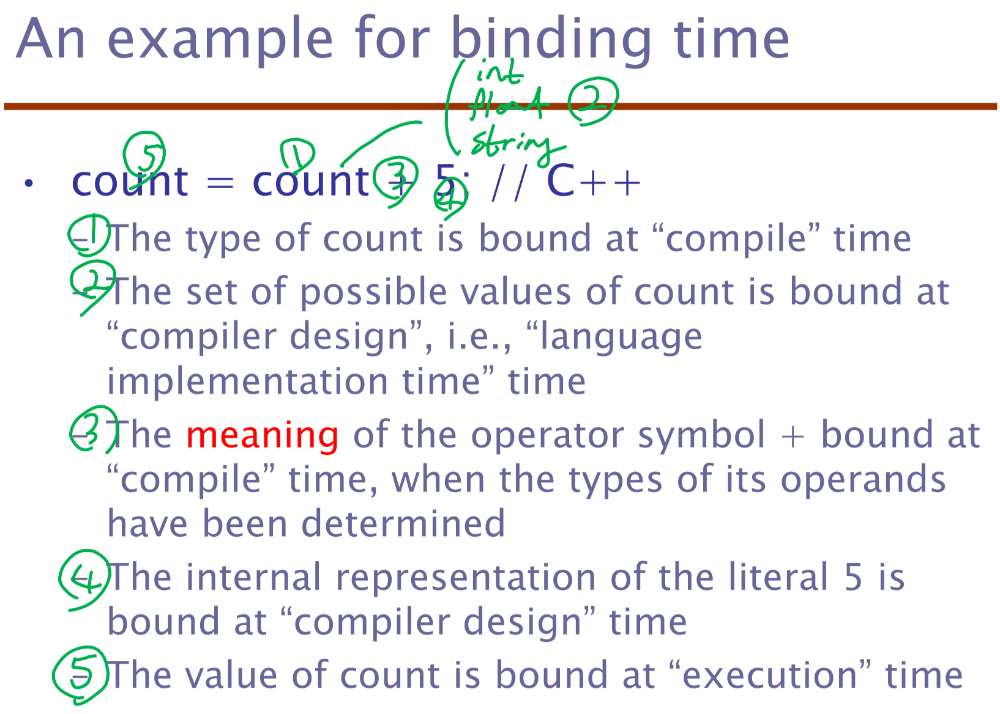
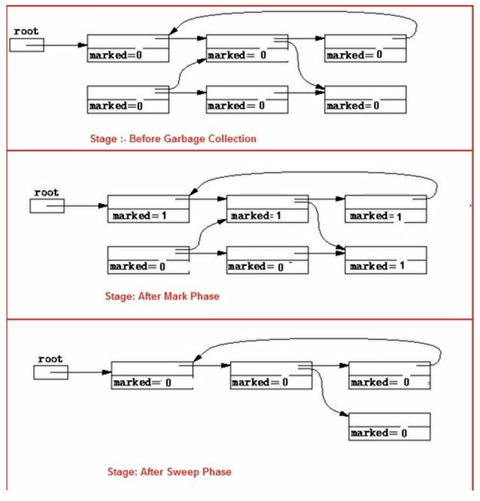
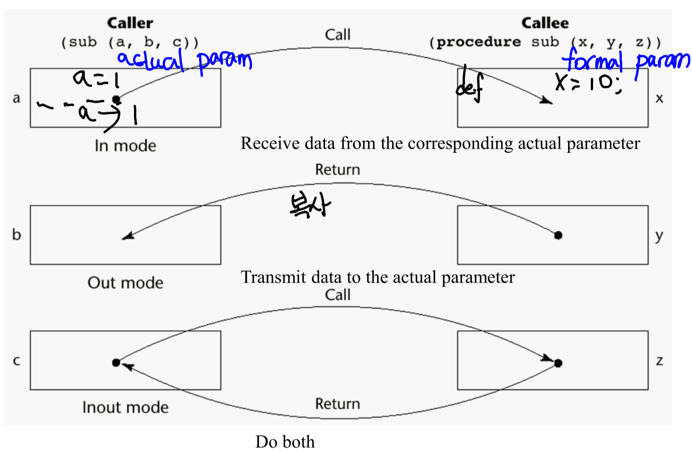
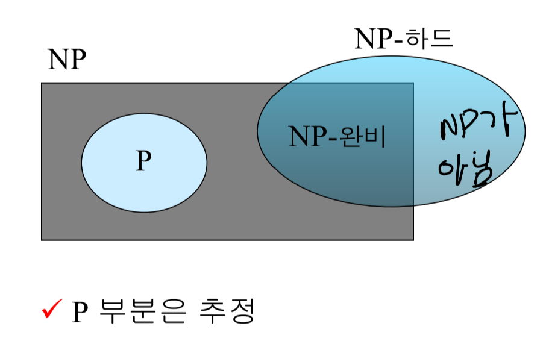

# Today I Learned (TIL)
## Since 2020.06.01 by DanielJung
### 원칙 1 : 주 2회 이상은 알고리즘 관련된 학습을 진행 후 작성  
## 2020.06.01 (Day 1)
- 컴파일러  
LR 구문 분석  
LL 구문 분석은 left-recursion 문제와 backtracking으로 인한 속도 문제로 인해 실제 컴파일러 사용하기엔 부적절  
따라서 위 2문제가 없는 LR 파싱을 주로 사용  
LR의 L은 Left-to-Right를 의미하며 R은 Rightmost derivation을 이용한다는 것을 의미한다.  
LR 구문분석방법으로는 SLR, CLR, LALR방법이 있다.

SLR 구문분석
SLR 구문분석은 LR(0) 항목과 FOLLOW를 이용하여 파싱표 작성 [파싱표 작성법 동영상](https://www.youtube.com/watch?v=ig-R03WwgLs)
1. Augmented grammar 생성(S' -> S)
2. LR(0) 항목 나열
GOTO(I<sub>0</sub>, symbol)의 경우 I<sub>0</sub>집합에서 symbol을 처리한 경우의 나오는 집합으로 I<sub>0</sub>에서 E 이후에 dot symbol을 위치한 후 CLOSURE를 계산한다.
새로 나오는 집합에 대해서는 I<sub>n</sub>으로 이름을 붙여주고, 새로운 집합이 나오지 않을 때까지 반복한다.
3. 모든 non-Terminal symbol에 대해 FOLLOW를 계산하여 나열한다.
4. SLR 파싱표의 GOTO표 부분은 symbol이 V<sub>N</sub>인 경우 몇번 집합으로 이동하는지 표시해준다.
5. 구문 분석기 행동의 경우  
reduce가 가능한(dot symbol이 마지막에 위치한 경우) reduce을 하며 E -> T인 경우 FOLLOW(E)의 항목들에 reduce작성하며 몇번 집합을 통해 reduce 되는지 표기한다.  
reduce가 불가능한 경우 shift하며 GOTO(상태, V<sub>T</sub>)의 집합 번호를 같이 기재한다.  
<u>1번 상태의 $는 항상 acc이다.</u>  
FOLLOW는 해당 symbol 다음에 나오는 모든 Terminal Symbol의 set이다.  

**<string>내일부터는 코드 작성 시작해야한다!</string>**  
- MarkDown Language  
header(제목) h1 ~ h6 '#'으로 표시 (예시: "###" h3)  
bold 는 **string** 으로 표시  
br대신 space 2칸으로 활용가능  
"[링크 표시될 제목] (링크)"
코드의 경우 ```로 코드 종류 명시 후 감싸주기  
인용문의 경우 > 이용
## 2020.06.02 (Day 2)
- Dijkstra Algorithm  
오랜만에 다익스트라 알고리즘 문제를 접하게 되었다. 작년에는 한참 종만북을 보며 연습했었는데, 아무런 공부없이 문제를 맞딱드리게 되니 머릿속이 하얘졌다.  
리트머스 문제를 풀기 위해서 psuedo code를 보기도 하였으나 기존의 이용했던 코드와 달라 작성하기 힘들었다.  
~~물론 문제에 오류가 있어서 시간을 모두 사용했다.~~  

다익스트라가 나온김에 한번 대표적인 문제의 코드를 보자.  
vector와 priority_queue를 이용해야 가장 효율적이다.
```cpp
#include<iostream>
#include<vector>
#include<queue>
#define INF 1e9
using namespace std;
 
int main()
{
    int V,E;
    scanf("%d %d", &V ,&E); //노드의 갯수와 엣지의 갯수를 입력받습니다. 
    int start;
    scanf("%d",&start);        //시작점을 입력받습니다. 
    vector<pair<int,int> > arr[V+1];
    
    for(int i=0;i<E;i++){
        int from,to,val;
        scanf("%d %d %d", &from , &to,&val); //그래프 상의 엣지들에 대한 정보를 입력받습니다. 
        arr[from].push_back({to,val});
    }
    int dist[V+1];    //최단거리를 갱신해주는 배열입니다. 
    fill(dist,dist+V+1,INF);    //먼저 무한대로 전부 초기화를 시켜둡니다. 
    priority_queue<pair<int,int> > qu;     
    
    qu.push({0,start});    //우선순위 큐에 시작점을 넣어줍니다. 
    dist[start]=0;    //시작점의 최단거리를 갱신합니다. 
    
    while(!qu.empty()){
        int cost=-qu.top().first;    // cost는 다음 방문할 점의 dist값을 뜻합니다. 
        int here=qu.top().second;     // here을 방문할 점의 번호를 뜻합니다 
        
        qu.pop();
            
        for(int i=0; i<arr[here].size(); i++){
            int next=arr[here][i].first;
            int nextcost=arr[here][i].second;
            
            if(dist[next] > dist[here] + nextcost){    
                //현재 next에 저장된 dist의값보다 현재의 점을 거쳐서 갈 경우가 
                // 거리가 더짧으면 갱신해 주고 큐에 넣습니다. 
                dist[next]=dist[here]+nextcost;
                qu.push({-dist[next],next});
            }
        }
        
    }
    for(int i=1;i<=V;i++){
        printf("%d\n", dist[i]);
    }
}
 ```

 - 컴파일러  
 C로 작성된 first, follow 코드는 찾았으나,  
  이를 C++로 수정해야하고 파일 입출력도 넣어야하지만 하지 못했다....  
  내일은 제대로 집중해서 컴파일러에만 시간을 할애해야겠다.

## 2020.06.03 (Day 3)
오늘은 하루종일 컴파일러에 집중했다.
- 컴파일러  
파일입출력을 통해 문법을 입력받고, 주어진 문법의 V<sub>N</sub>의 First와 Follow를 계산하여 출력하는 작업을 하였다. 물론 First와 Follow는 처음부터 구현은 힘들어 github의 다른 코드를 참조하였다.  
파일입출력은 ``ifstream``을 통해 작업하였으며, ``getline`` 을 사용하였다.  
```cpp
ifstream syntax;
syntax.open("syntax.txt");
if(syntax.is_open()) {
    while(!syntax.eof()) {
        syntax.getline(char[]name, maxlength); //주의할 점은 name은 char형만 가능
    }
}
```
또한 기존 코드에 처리되어있지 않은 2가지의 문법을 or로 구분하여 작성되어 있는 문법을 처리하였다.
> **from** (ex. A ==> B || C)  
> **to** (A ==> B) & (A == > C)

위 문장은 2개의 문장으로 분할하여 production rule에 추가하였다.  
SLR parser를 구현하기 위해서는 앞으로 ``CLOSURE``와 ``GOTO`` 함수 구현이 필요하다.  
오늘은 증가문법 (augmented grammar)는 완성하였다.  
현재 파서는 인덱스 구조로 되어있기 때문에 복잡한 문법은 처리하지 못한다. 특히나 터미널 심볼이 두 문자 이상으로 구성되어 있는 경우 처리하지 못하기 때문에 문제가 크다.  
앞으로 해결해야할 문제이다.

## 2020.06.05 (Day 4)
- OS / Main memory   
Memory allocation method에 대해 알아보았다. 그 중 아래 3가지에 대해 자세히 알아보았다.  
1. Contiguous Allocation
1. Segmentation  
1. Paging
>주로 메모리 할당에 관련해서는 2가지 항목을 평가한다.  
**Utilization(활용도) & Performance(Address Translation 소요 시간)**  

``Contiguous``는 가장 효율적이지 못한 allocation policy이다.  
연속적으로 무조건 할당해야하므로 Internal & External fragmentation이 매우 크다.  
또한 swap이 발생한 경우 유일하게 뛰어난 Performance도 저하된다.<br>

그렇기 때문에 나온 것이 ``Segmentation``이다. 이는 Logical Address Space를 분할해 메모리에 로드 할 수 있도록 한 것인데, 이러한 프로그래밍 방식을 개발자들이 이용하지 않아 사양됬다. 또한 Address Translation에 오랜 시간이 걸린다.  
<br>
다시 한번 개선된 것이 현재에도 쓰이는 ``Paging`` 기법이다.  
그러나 해당 기법에는 문제점이 있다.  
Page Table을 참조하기 위해 Memory에 2번 Access해야 하는 문제가 생긴다.  
이는 TLB Cache를 이용하여 해결한다. TLB hit ratio가 충분히 보장되는 경우 성능 저하가 거의 발생하지 않고  
Utilitzation은 page table을 hieraricial page table을 구성하여 높일 수 있다.  

- OS / Virtual memory  

Virtual Memory는 기존에 프로세스에서 요구하는 100%의 page에 frame을 할당해 관리하는 것이 아니라 일부 필요한 부분에 할당을 하여 **utilitzation을 극대화** 할 수 있는 방법이다.  
이를 위해서는 LAS와 PAS 사이에 Virtual Address Space를 이용한다.

로드된 이외의 영역은 storage device인 backing store에 저장한다.  
로드되지 않은 메모리 영역의 page를 요청하면 **page fault**가 발생하며 swap영역 또한 program image의 데이터를 가지고 온다.  물리 메모리가 부족한 경우 현재 잘 사용되지 않는 page를 골라(고르고 교체하는 작업을 수행) page replacement를 실시한다.

page replacement policy는 demand paging(페이지가 필요한 경우 즉각 로드하는) 사용 시 ``Belady's Anomaly``를 볼 경우 중요하다는 것을 알 수 있다.  
(크키가 커져도 page replace가 제대로 안되면 page fault 발생 횟수가 증가)  

이를 해결하기 위해 LRU Approximation Algorithm을 이용한다.
Enhanced Second-Chance Algorithm이 최신의 기술이다.

> Take ordered pair (reference, modify) 
>1. (0, 0) neither recently used not modified – best page to replace
>2. (0, 1) not recently used but modified – not quite as good, must write out before replacement 
>3. (1, 0) recently used but clean – probably will be used again soon
>4. (1, 1) recently used and modified – probably will be used again soon and need to write out before replacement

위 작업을 통해 circular queue를 이용해 문제를 해결한다.

## 2020.06.07 (Day 5)
- Data Communication 정리  
    1. Network Models  
        >5 계층 인터넷 모델에선 **Transport : TCP / Network : IP**만 사용하면 전부 Interntet이다.  
        
        각 계층별 역할을 살펴보자  
        - *물리 계층(Physical layer)* : 개별 비트를 인접 노드에 전달하는 역할, 선로의 물리적 특성과 전송방식을 다룸  
        - *데이터 링크 계층(Data Link layer)* : 안정적인 Next-hop deilivery 역할을 함. 데이터를 Frame 단위로 전송하는 Framing, Physical Addressing(MAC 주소) 등등. 현재는 주로 Ethernet을 기반으로 함  
        - *네트워크 계층(Network layer)* : Source-to-Destination 전송을 책임. 서로 다른 네트워크 간 전송도 책임(Routing). 현재는 주로 IP 프로토콜 이용.
        - *전송 계층(Transport layer)* : Process-to-Process delivery를 책임. 주로 port addressing 작업에 이용
        - *응용 계층(Application layer)* : 어떠한 서비스의 어떤 프로토콜을 이용해 전송할 것인지 결정. 사용자에게 서비스를 제공.
    
    1. Signals & Transmission  
        data가 전송되기 위해선 전자기적 신호로 변환이 되어야한다.  
        데이터 통신에서는 주로 **주기적 아날로그 신호(periodic analog signal)과 비주기적 디지털 신호(aperiodic digital signal)**을 사용한다.  <br><br>
        - Analog Signal  
            *Fourier transform* : **any composite signal => a combination of simple sine waves** with different freq, phase, and amplitude  
            ex) Square wave = 무한히 많은 Sine wave를 반복하면 만들어낼 수 있다.  
            그러나 medium에 따라 일부 주파수만 통과시키면 변형이 될 수 있다.

            **BandWidth** : medium이 정상적으로(출력의 half 이상 손실 없이) 통과시켜줄 수 있는 주파수 범위 (highest - lowest)
            
            따라서 Analog Signal을 확인할 때는 아래 2가지를 확인해야함
            > 1. Medium Bandwidth가 전송하려는 Signal의 Bandwidth보다 크거나 같은지
            > 2. Medium이 통과시키는 주파수가 Signal의 주파수 범위에 맞는지  
        - Digital Signal  
            Analog에서의 period = Bit interval, freq = Bit rate  <br>
            Digital Signal은 기본적으로 infinite frequency를 가짐  
            따라서 Digital Signal 원본을 송수신하기 위해선 Wide-Band medium이 필요하지만 가격이 비쌈  
            ``Nyquist therom``과 ``Shannon capacity``에 따르면 band limited medium에도 전송이 가능하다.

            >Nyquist Therom  
            **Medium BandWidth >= (number of bps) / 2**  
            단 1비트가 아닌 n비트를 신호 하나에 실어 보낼 경우 bps는 증가가능  

        - Analog transmission vs. Digital transmission  
            
            - low-pass channel : 특정 freq. 0 이상 f 이하의 bandwidth를 가지는 channel
            - band-pass channel : 특정 freq f<sub>1</sub> ~ f<sub>2</sub>의 bandwidth를 가지는 channel    

        **Digital transmission은** Digital signal을 전송하므로 이론적으로 0 ~ infinity의 대역폭(bandwidth)가 필요하므로 **low-pass channel이 필요함**  

        반면에 **Analog Transmission은 low 또는 band-pass에서 사용가능** 또한 **B/W 대역을 쪼갤 수 있음**  

        - Noiseless channel => ``Nyquist Therom``  
        > Bitrate in bps = 2 * Bandwidth * log<sub>2</sub>L  
        L : numbers of signal levels  

        - Noisy channel => ``Shannon capcity``  
        > *Capacity* in bps  = bandwidth * log<sub>2</sub>(1+SNR)  
        SNR : Power<sub>signal</sub> / Power<sub>noise</sub>

        **Channel Capacity보다 data rate를 높게 설정하는 것은 불가능하다.**

    1. Transmission Impairment(손상)  
        - Attentuation(감쇠) : medium의 저항으로 인해 손실되는 에너지 / amplifier를 통해 해결  
        dB = 10log<sub>10</sub>(P<sub>2</sub>/P<sub>1</sub>)  
        +이면 에너지 증폭, -이면 에너지 감쇠 / 단순 덧셈, 뺄셈 가능
        - Distortion(왜곡) : 각각의 signal은 전파 지연 속도가 다르기 때문에 신호가 왜곡될 수 있음
        - Noise(잡음) : 온도, 충격, 누화(crosstalk), 전기적 충격에 의해 신호가 손상될 수 있음  

    1. Digital Transmission  
        binary data => digital signal 변환하는 과정을 Line Coding이라고 함  
        - Signal Level & Data Level
            - Signal Level : signal에서 구분할 수 있는 단계 수
            - Data Level : data에서 구분할 수 있는 단계 수
        - Pulse rate & Bit rate
            - Pulse : symbol 하나를 전송하는데 걸리는 최소 시간
            - pulse rate : 초당 pulse의 전송 개수
            - bit rate = pulse rate * log<sub>2</sub>L  
            L : number of data levels
        - DC components : Amplitude가 순간적으로 0이 되는 순간을 신호로서 표현할 수 signal  
        추가 에너지를 필요로 하기 때문에 구현이 쉽지 않음

        - Self-syncrhonization(비동기)  
        
            - Unipolar encoding : 1개의 voltage level을 이용하여 간단하지만, dc componet 문제와 동기화할 수 없다는 점이 단점이다.
            - Polar encoding : 2개의 voltage level(+/-, signal level)을 써 dc component는 없지만, 동기화 문제 존재
                - NRZ-L : data 0은 positive voltage, 1은 negative voltage를 송수신  
                반복된 0 또는 1 data는 동기화 문제를 유발시킨다.
                - NRZ-I : data 0은 기존 전압 유지, 1은 전압 반대로 전환  
                NRZ-L보다 나은 동기화 성능
                - RZ : data에 맞는 신호를 보낸 후 0 voltage로 항상 전환하여 syncronization을 실시  
                단, 잦은 phase 변화로 frequncy 증가 -> 많은 bandwidth 소모 
                - Manchester : RZ에서 0 voltage 대신 중간 voltage transition을 이용해 b/w 절약
                - Differential Manchester : Manchester 방식에 NRZ-I 방식을 합함. data가 0이면 transition, 1이면 no transition이다.
            - Bipolar encoding : 3개의 Signal Level을 가짐
                - AMI : 1에서만 signal inverse  
                NRZ-L과 같은 단점 존재
                - BnZS : 다르게 인코딩한다... ~~자세한 설명은 없었음~~
            - 2B1Q : 2개의 비트, 4개의 signal level
            - MLT-3 : NRZ-I와 동일하지만, 3개의 signal level 사용
        - Block Coding : 전송 비트를 나눠서 블록 단위로 syncronization 문제 발생하지 않는 비트로 매핑
            - 4B/5B : 4bit를 5bit로 인코딩, 앞에는 0이 최대 1개, 뒤에는 0이 최대 2개만 중복함으로서 3개 이상의 0은 연속되지 않도록 함
            - 8B/10B : 8bit를 10bit로
            - 8B/6T : 8bit를 3개의 signal level을 가진 6개의 signal 3<sup>6</sup>로
        - **Analog data를 Digital 전송하기 위해서는 data sampling이 필요**
        - 이후 내용은 내일 이어서...
## 2020.06.08 (Day 6)
- data communication 정리 (cont.)  
    1. digital transmission
    - sampling
        - PAM(Pulse Amplitude Modulation) : analog data의 파형을 그대로 digital로 따라한 것
        - PCM(Pulse Code Modulation)  
            PAM => **Quantization** => binary encoding => line coding  
            <u>**sampling rate는 원래 신호의 최대 주파수의 2배 이상으로 해야한다!**</u>  
            band-pass signal을 low-pass signal로 변환하여 sampling 할 경우 signal bandwidth의 2배를 sampling rate로 잡으면 된다.  
            각 sample 당 필요한 bit 수는 ceiling(log<sub>2</sub>N)개 이다.  
            따라서 bit rate = sampling rate * number of bits per sample
    - Transmission mode
        - Parallel
            : 고속이나 선로 부담이 커 비용이 비쌈, 주로 짧은 거리에 이용  
        - Serial 
            : 동기시스템과 비동기시스템으로 나뉜다. 
            - 비동기 시스템은 신호의 시기나 순서가 중요하지 않은 시스템. 시작비트, 종료비트로 바이트 단위를 구분해 전송. 저렴하며 효율적이지만 느리다.
            - 동기 시스템은 바이트 단위 구분 없이 전송한다. 따라서 바이트 단위의 순서가 중요하다.  

    2. Analog transmission
        - Terminology
            - modulation : digital/analog data -> band-pass analog signal
            - baud : signal unit / baud rate : # of signal units per second
            - carrier signal : 기준 주파수 (+ 유저의 데이터를 추가하여 전송)
        - ASK(Amplitude Shift Keying)
        : 단순히 신호의 세기를 변조해 데이터의 0/1을 표시하는 방법  
        b/w = baud rate와 동일한 만큼 필요(f-N<sub>baud</sub>/2 ~ f+N<sub>baud</sub>/2)  
        ASK에선 baud rate와 bit rate가 동일  
        단순하지만 noise에 약함
        
        ASK full-duplex 문제 참고.

        - FSK(Frequency Shift Keying)
        : 2개의 주파수를 이용해 주파수에 각 0, 1을 할당하여 변조하는 방법  
        FSK에 특별히 적합한 주파수가 존재  
        b/w = f<sub>c1</sub> - f<sub>c2</sub> + N<sub>baud</sub>(baud-rate)  
        FSK에서도 baud rate와 bit rate가 동일

        - PSK(Phase Shift Keying)
        : signal의 phase에 따라 데이터를 변조하는 방법  
        Minimum b/w = N<sub>baud</sub>  
        PSK의 경우 baud rate와 bit rate가 동일하지 않을수도 있음으로 유의 **(2<sup>1baud to bit</sup>-PSK)**  

        - QAM(Quadrature Amplitude Modulation)  
        : ASK + PSK 방식  
        PSK와 동일하게  **(2<sup>1baud to bit</sup>-QAM)**으로 표기

        - Modulation of analog signal
            1. AM : total required b/w = audio signal * 2
            2. FM : total required b/w = audio signal * 10
        

## 2020.06.18 (Day 7) : PL summary
1. chapter 1 Preliminaries
    - Programming Domains
        - Scientific application : Fotran - 많은 수의 부동소수점 계산과 배열 활용
        - Business application : COBOL - 레포트 작성, 십진수와 문자 사용
        - Artificial application : LISP - 숫자 조작보다는 기호를 이용, 링크드 리스트의 활용
        - System programming : C - 지속적 사용으로 인한 효율성 극대화 필요
        - Web software : HTML, PHP, Java - 호환성 필요
    - Language Evaluation criteria
        - ``Readability`` : 가독성, 간단하고 직교성(적은 수의 구조체를 가지고 프로그래밍)을 가지는 지, 적절한 data types를 가지고 있는지
        - ``Writability`` : 표현성 (가독성과 마찬가지로 약간 주관적), 추상화에 대한 지원이 있는지, 표현이 얼마나 편리한지
        - ``Reliability`` : 신뢰성, language가 **typesafe** 한지 여부가 대표적, exception handling과 aliasing 지원 여부
        - ``Cost`` : 컴파일러 실행 시간 + 실행 속도 + 유지보수 비용 + ... 다양한 시간, 비용 계산
    - Language Design : *사람이 변화할 때, 컴퓨터 구조가 변화할 때, 함께 변화한다.*
        - 대부분의 컴퓨터 언어의 구조는 폰 노이만 구조의 영향을 크게 받음
        - 명령형 언어의 기반 : 변수 => 메모리 셀 매핑, assignment statement, iteration에 강함
    - Programming methodology
        - 1950s ~ early 1960s : H/W인 기기의 효율성을 중시 - 어셈블리어
        - late 1960s : 사람의 효율성을 점차 중시하게 되며 가독성, 더 나은 control structure 를 원하게 됨. 구조화된 프로그래밍, top-down 방식의 디자인의 등장
        - late 1970s: data-oreiented 로 변화를 시도하였으나 실패
        - Middle 1980s : object-oriented   
        **data abstraction + inheritance + polymorphism**
    - language categories
        1. Imperative - 폰 노이만 구조 기반 : C, Java, Perl, JS, C++...
        1. Functional - lambda function을 이용한 구조 : LISP, Scheme
        1. Logic - expert system 개발에 이용, 현재 사용되지 않음 : prolog
        1. Markup & hybrid - 다른 프로그램을 지원하기 위한 language : JSTL, XSLT
    - Implementaion methods
        - Compilation : 컴파일 방식 (속도 ↑, 개발기간 ↑)
        - Pure Interpretation : 인터프리터 방식 (속도 ↓, 개발기간 ↓)
        - Hybrid 방식 : compilation + interpretation
    - Compilation : **Slow translation, Fast execution**
        - Load module : 운영체제나 기능이 미미한 경우 system code와 user code를 한번에 load함
        
    - Von Neumann Bottleneck : CPU와 Memory 사이의 bottleneck 현상
    - Pure Interpretation : **Easier implementation, Slower execution**  
    No translation, Often requires more space
    - Hybrid Implementation system : compilation + pure interpretation
    - Just-in-Time Implementation System  
    Java -> bytecode 는 interpretation 방식으로 즉시 변환하고, bytecode -> machine language는 호출 시 컴파일  
    1회 컴파일, 실행 시 해당 machine code는 저장(이후의 호출 시 이용) 
2. chapter 3 Syntax and Semantics
    - Syntax : expression, statement의 구조나 형태
    - Semantics : Syntax가 가지는 실질적인 의미
    - Lexeme & Token 

## 2020.06.19 (Day 8) : PL Summary(cont.)
- BNF 문법은 Context-Free grammar를 전부 표현 가능  
    LHS : non-terminal => RHS : terminal & non-terminal  
    non-terminal은 <> 안에 둘러쌓여서 표현  
    ex) <ident_list> -> ident | ident, <ident_list>  
    sentential form : terminal symbol로만 이루어진 sentence가 되기 이전까지의 과정
    - 같은 문법에 대해 다른 parse tree가 발생하면 모호한(ambiguous)한 문법
    - 따라서 우선순위(precedence)와 결합법칙(associativity)를 이용
    - 우선순위를 통한 분리방법
        1. 우선순위가 낮은 연산자가 먼저 나오도록 한다.
        1.  | <term> 을 이용해 보다 높은 우선순위의 연산자를 재 기술
        1. <term> -> 높은 순위 연산자 기술
- **EBNF 표기법**
    > "[ ]"기호는 생략가능한 부분  
    > "(+/-)" 와 같은 기호는 기호들 중 택해야 함  
    > "{ }" 는 0회 이상 반복되는 부분(생략도 가능) 


3. Chapter 4 Lexical & Syntax analysis
    - Regular grammar => Regualr expression => Finite-state machine(FSM)
    - Context-free grammar => BNF => push-down automata

4. Chapter 5 Names, Bindings, Scopes
    - *메모리 주소에 대한 언어에서의 추상화 방식은 **변수***를 이용하는 것이다.
    - 6가지 sextuple로 변수의 특성을 설명할 수 있다.
    1. Names : 변수의 특성 중 근본적인 속성 한가지 이다. 함수, 인자와 연관되어있음
        - 주요 디자인 이슈 : **Case sensitive(대소문자 구별), reserved words, keywords**
        - 형태 : Camel notation을 많이 사용(ex. ScoreValue) 앞글자를 대문자로
        - Case-sensitivity / Special words : 필요는 하나 너무 많으면 문제
    1. Address : *aliases*는 같은 메모리 주소를 가르키지만 다른 이름을 가진 별칭
    1. Type : 변수 값의 범위와 연산
    1. Value : l-value 는 address, r-value는 value를 의미
    1. Lifetime
        > Binding : entity와 attribute 사이의 연결
        - *binding이 발생하는 시간에 따라 Static, Dynamic binding이 존재*
        - <u>언어 디자인, 구현, 컴파일 타임</u>에 바인딩 되어 있는 것을 **Static binding**
        - <u>프로그램 로드 시, 런타임</u>에 바인딩 되는 것을 **Dynamic binding**
            
        - Static Binding  
        <sup>1</sup>실행(runtime) 이전에 바인딩이 완료되며, <sup>2</sup>실행되는 동안 바인딩이 변경되지 않음 
        - Dynamic Binding  
        <sup>1</sup>Compile time 이후에 바인딩되거나, <sup>2</sup>프로그램 runtime에 binding이 변경됨
        - Type binding : 변수를 사용하기 이전에 필수적으로 data type에 대한 binding이 되어있어야한다.
            - type 지정 방법
                - static type binding : 선언 시 type이 지정됨
                    - explicit(명시적) 방법 : data type을 직접 명시함(ex. int, char)
                    - implicit(묵시적 방법)
                        - naming convention : type별 변수 이름의 규칙이 지정되어있음
                        - context : 문맥을 보고 compiler가 data type을 유추
                - dynamic type binding : 할당 시 binding
                    - 변수에는 특별히 지정된 data type이 있는 것이 아님
                    - 선언 시 상황에 맞게 매핑됨
                    - *단점으로는 type checking이 불가능하고, H/W resource를 많이 차지*

        - Storage bindings & **Lifetime**
            - 전체적인 속도 : static < heap = stack
            - Static
                - bind storage before execution
                - 프로그램 <u>실행 동안에는 계속 같은 공간에 bound</u>
            - Stack-dynamic
                - variable이 declare 될 때 stack에 할당
                - 몇몇 언어는 subprogram의 처음이 아니여도 declare 가능
                - 간혹 성능 최적화를 위해 변수 선언이 subprogram 처음으로 이동하기도 하지만, 무조건적으로 올려서는 안됨
                - 장점
                    1. **recursion이 가능하다.** (매우 큰 장점)
                - 단점
                    1. *allocation과 deallocation에 overhead가 발생한다.(속도 ↓)*
                    1. subprogram이 histoy sensitive하지 못하다.
                    1. indirect addressing으로 인해 reference가 비효율적이다.
            - explicit heap-dynamic
                - <u>명시적으로</u> 개발자가 연산자, 시스템 콜 호출을 통해 **heap영역**에 데이터를 생성
                - 장점 : 동적 공간 할당과 관리를 제공해준다.
                - 단점
                    1. pointer와 reference를 통해 관리하는데 어려움이 발생
                    1. 변수의 reference로 인한 비용이 든다. 
                    1. storage management를 구현하기 위한 복잡성이 증가한다.
            - implicit heap-dynamic
                - assignment statement를 만나는 순간 allocation과 deallocation이 동시에 일어난다.
                - 이전에 해당 변수가 어떠한 type이였는지는 관여하지 않는다.
                - 장점 : 가장 높은 flexibility 제공
                - 단점
                    1. dynamic attributes를 유지하기 위한 runtime overhead 발생 (속도 ↓)
                    1. error detection이 불가능하다. (realiability ↓)
    1. Scope
        - local variable : program unit내에 선언된 변수
        - nonlocal variable : program unit내에서 참조할 수는 있으나 외부에서 선언된 변수
        - Global variable : nonlocal variable중에 하나  

        - **Static scope** : <u>compile time에 nonlocal 변수의 reference 위치를 결정할 수 있음</u>
            - static scoped language
            - subprogram이 nested가 가능한 경우 : 실행속도 ↓, 제약 없음
            - subprogram이 nested가 불가능한 경우 : 실행속도 ↑, 제약 존재
            - 호출 스택이 아닌 코드만 보고 가장 가까운 static ancestor를 찾아 참조한다.
             ***이 그림 꼭 확인하기!!***
            - 같은 이름을 가질 경우 더 가까운 변수가 선택된다.
            - 대부분의 functional language는 `let`을 이용해 imperative language의 block를 의미한다.
            - C99, C++, Java, C#은 선언 시점부터 block의 끝까지 변수를 이용할 수 있다.
            - Global scope (global variables)
                - declaration : function prototype
                - definition : attribute and storage
                - C/C++ 에서는 `extern`을 이용해 외부의 전역변수를 이용 
                - PHP 에서는 그림 참조 
                - Python 에서 read는 가능, write는 `extern`과 마찬가지로 `global` 사용해서 선언해줘야 가능 (전방참조 주의!)
        - ***Static scope 방식은 대부분의 경우에 잘 작동하나, 구현시 오버헤드가 크다.(enclosed scope)***
        - ***Dynamic scope : nonlocal 변수의 reference 위치를 코드로는 알 수 없고 실행시 call-chain을 통해 알게 됨(all active subprogram)***  

        <u>**Static-scoped language와 Dynamic-scoped language의 차이점 매우 중요!**</u>
        - Scope != Lifetime (ex. `static` variable)
        - Named Constant : 1회 storage binding만 가능한 형태 (가독성이 뛰어나짐)
            - dynamic bound : expression 전체가 RHS에 가능
            - statically bound : 숫자 & named constant로 구성된 RHS가 가능  

5. Chapter 6. Data Types <sup>1.</sup>data representation <sup>2.</sup>operation
    - Primitive Data Types (기본 데이터 타입)
        - 몇몇은 하드웨어의 반영결과이다.(ex. integer types)
        - 다른 structered type를 정의하는데 사용
        - Integer
            - representation : H/W mapping 상태(표현과 저장방식 동일)
            - operation : Two's complement
        - Floating point
            - 지수부(exponent)와 가수부(fraction) 부분으로 나눠서 사용
        - String
            - pattern matching 연산(Perl 지원)
            - C/C++에서는 non-primitive / Java, C#, Ruby, Perl.. 등 대부분에서 primitive 한 data
            - 특히, Perl, JS, Ruby, PHP에서는 regular expression을 지원
            - 문자열의 길이 지정
                - static : 정적
                - limited dynamic : static 방식이나 내부적으로 복사 작업을 통해 유지
                - dynamic : 완전히 동적인 방식으로 길이에 대한 제한이 전혀 없음

## 2020.06.20 (Day 9)
- Enumeration Types
    - 주요 디자인 이슈
        - 서로 다른 enum type에서 같은 이름을 사용할 수 있느냐?
        - enum value가 정수에 매핑되느냐?
        - 열거형으로 작성하도록 제한된 유형이 있느냐?
        - 코드의 **가독성과 신뢰성이 높아짐**, 그러나 코드 작성은 어려워짐(길어지고, 지루함)
- Array types
    - homogeneous(동일)한 여러개의 데이터를 집적시켜 놓은 형태
    - 주요 디자인 이슈
        - array의 index(subscript)에 적절한 타입은 무엇인가
        - subscript expression의 range check를 실시하느냐
    - Array indexing
        - 몇몇 언어에서는 괄호(parentheses)를 이용
        - 대부분은 bracket `[]`을 이용
        - Ada : subscript type으로 enumeration type을 사용
        - Java, ML, C#은 range check 진행
        - Perl의 경우 독특
        ```pl
            @signs = (0, 1, 2 ,3, 4); // 선언
            $signs[2]; // 3번째 원소 접근
            $signs[-2]; // $signs[3]과 동일
        ```
        - lower bound(인덱스 시작값)은 지정할 수 있는 경우도 있음  
    - Array categories
        - static array : data segment에 array 할당 / subscript range와 storage 할당이 static하게 이루어짐
        - *fixed stack-dynamic array* : stack segment에 고정 크기로 할당 /  
            <u>subscript range는 static하게, array storage allocation은 execution time에 **stack**에 할당</u>
        - *fixed heap-dynamic array* : heap segment에 고정 크기로 할당 /  
        <u>fixed stack-dynamic array와 bound time은 동일하나, **heap**에 할당</u>
        - ***heap-dynamic*** : heap segment에 가변 크기로 할당 /  
        <sup>1</sup>subscript range와 storage allocation 모두 execution time에 발생하고,  
        <sup>2</sup>이를 프로그램 수행 중 변경이 가능하다.
            - 프로그램 유연성이 높아지나 속도는 할당과 해제로 인한 성능 저하
    - JS의 경우 array가 sparse 할 수 있으며, 이러한 경우 배열 내에서도 nonexist element가 존재
    - Array initialization & operation
    - Rectangular array : 직사각형 형태 `[N][N]` array
    - jagged array : 각각 길이가 다른 배열들의 배열  `[N][M]` array (N != M) 
    - Row major, Column major : 행과 열 중 어떤것을 메모리 인접하여 저장할 것인지
    - 다차원의 배열의 위치 : `address of a(row의 lower bound, column의 lower bound) + ((i - 1) * n) + (j - 1) * element size`
- Associative arrays
    - (key : value) 쌍으로 이루어진 순서가 없는 data elements의 collection
    - Perl : `%hi_temps = ("Mon" => 77, "Tue" => 79, "Wed" => 65, ...);`  
    ```pl
    $hi_temps{"Wed"} = 83;
    delete $hi_temps{"Tue"};
    ```
- Record type : hecterogeneous(서로 다른) data elements를 가짐  
- tuple types : Record type과 비슷하나, element 별 name이 존재하지 않음
    - immutable -> 한번 선언 후에는 값을 바꿀 수 없음
    - tuple을 지원하지 않는 C에서는 반환값을 2개 주려면 어떻게 코딩하는지 알아둘것
        1. struct를 반환하는 방법
        1. pointer를 이용해 반환하는 방법
- list types : tuple과 동일하나 mutable함
    - Python 에서는 `[]`로 List를 표현
    - Python list comprehension : 식으로 표현하여 List 연산
    ```py
        [x * x for x in range(6) if x % 3 == 0] // result : [0, 9, 36];
    ```
    - '(A B C) 이면 List type (A B C)는 A라는 함수를 B, C라는 인자로 호출
- Union types : 하나의 메모리 공간안에 여러개의 변수를 넣어 사용
    - *Free union* vs. *Discriminant*
        - *Free union* : type checking 없음 -> unsafe
        - *Discriminant union* : type checking 있음 -> safe, but slow
- Pointer(초기값 필요없음) and Reference(초기값 필요) types
    - range of values : *memory address + nil*
    - Operation
        - assignment : set a pointer
        - dereferencing : explicit & implicit 방식
    - **problems**
        1. <u>Dangling pointers</u> -> danger
            - 없는 변수(이미 해제된)의 메모리 참조
            - 해결방법
            
                > Tombstone 방법  
                    - 모든 pointer들은 기본적으로 tombstone이라는 pointer를 참조  
                    - 만약 해당 변수가 해제되었다면 tombstone에 RIP을 명시한다.  
                    - RIP처리된 변수는 접근할 수 없도록 한다.  

                > Locks-and-keys 방법  
                    - 변수 할당 시 pointer와 heap variable에 각각 key와 lock 값을 추가한다.  
                    - 기본적으로 변수가 할당이 된 경우 pointer의 key값과 lock 값은 동일하다.  
                    - lock == key 인 경우에만 변수 접근 가능
                    - 변수 해제 시 lock 값을 초기화하여, 접근을 차단
        1. Lost heap-dynamic variable
            - heap영역의 동적할당된 변수의 주소를 잃어버림
            - memory leakage 발생
    - usage in C / C++
        ```c
        int a = 10;
        void* p = &a;
        *p; // error, void pointer can't de-reference
        *(int *)p; //ok
        ```
- Reference type
    - C++에서는 reference 지정후 변경 불가능
    - Java 에서는 가능
    - C#에서는 2가지 type 가능
- Heap management
    - Reference counter
        - 각 메모리셀에 자신을 가르키고 있는 포인터의 수를 저장
        - 이 숫자가 0이 될 경우 메모리 해제
        - 단점 : 추가적인 메모리 공간 필요, 수행시간 증가
        - 장점 : 점차적으로 메모리 공간이 증가, 딜레이가 없음
    - Mark-sweep
    
        - pointer를 따라가 만나지 않는 메모리셀 부분은 해제
        - 메모리가 부족할 때만 실행하므로 delay가 존재
- Type checking : operator의 operand로서 compatible type인지 확인하는 작업
    - *compatible type* : 언어 특성으로서 operator가 처리할 수 있는 합법적인 연산자인지 확인, 자동으로 형변환으로 처리가 가능한지 여부
    - 자동으로 compatible type으로 형변환 되는 것을 **coercion**이라고 한다.
    - coercion이 불가능한 경우 type casting이 필요
    - type binding이 전부 static 한 경우 type checking도 전부 static하다. dynamic이면 type checking도 dynamic하다.
    - *strongly typed* language의 경우 모든 type error를 체크할 수 있다.
    - **Coercion 이 많아지면 많아질수록 strong typing은 약화된다**
    - Name type equivalence = Type의 Name이 같아야 type equivalence하다.
        - 구현하기 쉽지만, 사용이 제한적이다.
    - Structure type equivalence = Type의 Name 동일 유무와 상관없이 구조가 동일하면 compatible type이다.
        - 코드 작성이 자유롭지만, 구현이 어렵고 동일하다는 기준이 모호하다.

## 2020.06.21 (Day 10)
6. Chapter 7. Expression and Assignment statements
    - Expression : 프로그래밍 언어에서 기본적인 계산 단위를 표현
        - order of operator & operand evaluation에 대해 이해해야 한다.
        - 우선순위와 결합법칙
        - *대부분 피연산자의 계산 우선순위는 지정되어 있지 않으며, 구현에 따라 다름*
        - 명령형 언어(imperative)의 핵심은 assignment statement로 부터 시작된다.
            - 가장 큰 장점이자 단점이 **side effect(부수적인 효과) : 자신의 스코프 외부의 변수의 값을 변경**
    - Arithmetic expression
        - 연산자 수에 따라 Unary, Binary, Ternary operator로 분류
        - 연산자 위치에 따라 Prefix, Infix, Postfix operator로 분류
        - Evaluation order
            - Operator
                - Precedence rule : 수학자들의 정의에 의해
                - (괄호 -> 단일 연산자 -> 승수(power) -> 곱셈 나눗셈 -> 덧셈 뺄셈)
                - Associativity rule : 기본적으로 왼쪽부터 진행하나, 승수의 경우 오른쪽부터 계산
            - Operand
                - 식이 있는 경우, side-effect가 있다면 evaluation 순서에 따라 다름
                - functional side-effect : 자신의 인자, 또는 전역 변수를 수정하는 함수
                ```c
                int a = 5;
                int fun1() {
                    a = 17;
                    return 3;
                }
                void main() {
                    a = a + fun1(); //왼쪽부터 실행하는 경우 8, 오른쪽부터 실행하는 경우 20.
                }
                ```
                - functional side-effect는 표준이 없으므로, Implementer에 따라 다르다.
        - **Referential transparency**
            - `result = (fun(a) + b) / (fun(a) - c);`에서 `temp = fun(a);` 이후 `fun(a)`를 `temp`로 바꿔도 동일 한 경우 <u>Referential transparency 존재</u>
            - <u>함수 `fun`이 **side effect가 없어야 가능**</u>
            - program을 이해하기 쉽다는 장점
            - *Pure functional language*는 assignment 없음 -> side-effect 없음 -> *referential transparency 가짐*
    - Overloaded operator
        - 하나의 operator가 다양한 용도로 사용되면 operator overloaded 상태
        - ex) 정수의 덧셈(+)연산과 실수의 덧셈(+)연산
        - compiler의 error detection 방해와 가독성 저해 문제가 발생 가능
        - user-defined overloaded operator
            - 잘 사용하면 가독성 증가
            - 잘못 사용하면 가독성 저해
    - Type conversion
        - narrowing conversion : 데이터 사이즈 大 -> 사이즈 小, *데이터 유실*
        - widening conversion : 데이터 사이즈 小 -> 사이즈 大, *데이터 보존*
        - mixed mode : operand가 서로 다른 type을 가진 expression을 mixed mode라고 통칭
            - type conversion
                - widening conversion의 경우 ***coercion(Implicit type conversion)***이 발생
                    - program을 작성하기 편리해짐
                    - compiler의 error detection 능력 저하(실수 유발 가능성)
                    - C기반 언어에서는 int보다 작은 type의 덧셈은 int로 coercion 후 계산
                - Explicit Type conversion (Casting in C) 명시적
    - Errors in expression
        - div by zero, overflow -> exception handler로 처리
## 2020.06.22 (Day 11)
6. Chapter 7. (cont.)  
    - Boolean Expression
        - JS와 PHP에서는 `==`는 type conversion이후 값을 비교하지만 `===`은 type conversion 없이 비교
        ```js
            "7" == 7 // true, "7"은 int형으로 coerced 됨
            "7" === 7 // false, "==="은 coerce 적용하지 않음
        ```
        ```c
        if(a < b < c) // a < b evaluation 결과가 반환(true 또는 false)되고, 그 값과 c를 비교 
        ```
    - Short circuit evaluation
        - 전체를 evaluation하지 않고, 일부분만 evaluation을 하면 전체 값을 알 수 있는 경우
        ```c
        int index = 0;
        while((index < length) && LIST[index] != value) // short-circuit evaluation 하지 않는 경우 오류 발생
            index++;

        (a > b) || (b++ / 3); // b의 값은 a <= b인 경우만 변경
        // short-circuit evaluation 상황에서 side effect가 발생하는 매우 부적절한 상황 
        ```
    - Assignment statement 
        - `=`에 assign과 comparison 2개의 기능을 overloading하는 것은 부적절하므로 `==` 사용
        - Conditional targets
            ```pl
            ($flag ? $total : &subtotal) = 0 // flag가 true이면 total = 0; 아니면 subtotal = 0;
            ```
        - Compound assignment operator : `a += b` => `a = a + b`
        - Unary assignment operator : `a++` or `++a`
        - Assignment as an Expression : `while((ch = getchar()) != EOF) {...}`
            - side-effect를 일으킬 수 있어서 코드를 이해하기 힘들게 함
            - 조심해서 사용해야 함
            - ex) `a = b + (c = d / b) - 1;`
        - Multiple assignment : `($first, $second, $third) = (20, 30, 40);`
        - Assignment in functional language
            - **순수 함수형 언어에는 assignment가 존재하지 않음**
            - `val fruit = apples + oranges;`는 val 에 값을 바인딩하는 작업
            - 위와 같이 바인딩하면 값을 절대 바꿀 수 없음(필요시 re-binding 해야함)

7. Chapter 8. Statement-Level Control structures
    - Control structure : statement간에 program flow를 control하는 구조 ex) `if-else`, `for`,...
    - Selection statements
        - two-way : `if - then` 
            - nesting selector(중첩 if문)의 경우 else는 가장 가까운 if에 매칭이 된다.
            - Selector expression : 함수형 언어에서는 if가 expression 역할도 할 수 있음 
        - multiple-way : `switch`
            - `switch(`control expr`)`에서 `control expr`은 어떤 type을 허용할 것인지?
            - 해당하는 case만 실행시킬 것인지, 다음 case에 대한 처리까지 수행할 것인지?
            - C#와 C/C++에서의 차이점
                - switch문 내에서 한개의 case(segment라고 칭함)만 실행해야함. 즉, 각 case 마다 unconditional branch(break)로 마무리 해야함
                - `control expr`이여도 실행이 가능
            - Scheme의 경우 `COND`를 사용
            ```s
            (COND
                ((> x y) "x is greater than y")
                ((< x y) "y is greater than x")
                (ELSE "x and y is equal")
            )
            ```
    - Iterative statements
        - Counter-Controlled Loop, ex)`for-loop`
            - loop variable + (initial; terminal; stepsize)
            - C와 C++의 차이점
                1. terminal(control) expression이 boolean도 허용
                1. C++에선 initial expression에 변수 선언도 가능
            - Java와 C#
                - terminal(control) expression은 **무조건 boolean만 가능**
            - functional language에서의 counter-controlled loop
                - functional language에는 assignment가 존재하지 않음
                - 따라서 variable이 존재하지 않으므로, recursive call로 구현
        - Logically-Controlled Loop, ex)`while, do-while`
            - pretest(loop 수행 전 조건 검사) & posttest(loop 수행 후 조건 검사)
            - Java는 항상 boolean 타입이여야하며, goto문이 존재하지 않는다.
        - User-Located loop control - Loop 도중 제어(`continue, break`)
        - Iteration based on Data structure
            - C ex) `for (p = root; p != NULL; traverse(p)) {...}`에서 `traverse`는 iterator function
            - PHP에서는 `current(), next(), reset()`을 제공한다.
            - C#, Java 5.0에는 `foreach`사용
        - Uncoditional branching : `goto`
            - 중복된 반복문을 한번에 `break`하기 위해 사용
    - **Guarded Commands**
        - 코드의 안정성을 위해 새로운 방법을 개발
        - concurrent(동시성)을 가지기 때문에, evaluation 진행순서는 중요하지 않음(바뀌어도 문제가 없음)
        - Selection Guarded Command
            ```c
            if <Boolean expr> -> <statement>
            [] <Boolean expr> -> <statement> 
            ...
            [] <Boolean expr> -> <statement>
            fi
            ```
            - 모든 boolean expr은 parellel하게(순서에 상관없이) evaluation
            - 하나라도 true가 되는 경우 참인 `statement`중 random하게 하나를 실행
            - 모두 false인 경우 error 발생
        - Loop Guarded Command
            ```c
            do <Boolean expr> -> <statement>
            [] <Boolean expr> -> <statement>
            ...
            [] <Boolean expr> -> <statement>
            od
            ```
            - 위와 동일하게 모든 expr을 evaluate함
            - 하나라도 true인 expr이 있다면 그러한 expr 중 random하게 선택하여 실행
            - 실행 후에는 다시 처음부터 반복
            - 모든 expr의 evaluation result가 false여야 종료

8. Chapter 9. Subprograms
    - Function & Procedure
        - Procedure : return value가 없이, 명령어의 묶음을 뜻하는 단어 (void function)
        - Function : return value가 존재하여 결과 값이 있는 경우
        - subprogram = procedure + function
    - 모든 subprogram은 entry point(진입점)이 1개이다.
    - calling program은 called subprogram이 종료될때까지 정지해있는다.
    - subprogram definition & call
        - subprogram definition : `void f() { ... }`
        - subprogram call : `f()`
        - subprogram active : 호출되어 아직 return 하지 않고 함수가 실행중인 상태
        - Python에선 function definition이 excutable(상황에 맞게 정의가 가능하다.)
        ```py
        if a == 1   // a가 1인 경우
            def fun(...) :
                ...
        else    // a가 1이 아닌 경우
            def fun(...) :
                ...
        ```
        - 미리 컴파일러에게 함수 호출에 필요한 type과 반환형, 함수 이름을 알려주는 것 : function declarations
        - formal parameter(함수 정의 시) vs. actual parameter(호출 시)
    - Actual/Formal Parameter corredpondence(매핑)
        1. positional : 첫번째 actual parameter는 첫번째 formal parameter로...
            - 안전하고 효율적
        1. keyword : `void f(int a, int b); f(a = 1, b = 2);`
            - 임의의 순서를 바꿔도 상관없고, 매핑이 분명함
            - 개발자가 formal parameter 이름을 전부 알아야 함
    - Formal parameter default value
        - python의 default 값
        ```py
        def compute_pay(income, exemption = 1, tax_rate)
        pay = compute_pay(20000.0, tax_rate = 0.15) // exemption = 1이 자동으로 삽입
        ```
    - 가변인자 파라미터
        - 인자의 수가 고정이 아닌, 변할 수 있는 함수 ex)printf
        - 위의 default value를 지원하지 않는 언어에서는 가변인자를 대부분 지원하지 않음
        - positional 매핑 방식에서만 가변인자 제공
        - C#에서는 `params`키워드를 이용하여 간편하게 가변인자를 정의가능(같은 data type에 한해)
    - Local referencing environments
        - subprogram의 local variable을 저장공간을 stack-dynamic 또는 static하게 할당
        - 대부분의 현재 언어는 stack-dynamic한 변수를 만듦
    - **<u>Parameter passing</u>**
    
        1. In mode
        1. Out mode
        1. Inout mode
    - Implementation model of "Parameter Passing"
        1. Pass(Call)-by-Value (In Mode)
            - 단순 복사(값 또는 포인터)를 통해 구현한다
            - disadvantage
                - Physical move method : 2중으로 저장공간이 소요된다.(저장공간 낭비, 복사에 이용)
                - Access Path method : subprogram에서 값을 변경하지 않도록 write protect가 따로 필요하며, indirect addressing으로 인해 속도가 저하된다.
        1. Pass-by-Result (Out Mode)
            - Out Mode의 개념을 그대로 구현
            - formal parameter로 값을 전달하지 않고, call 종료 시 actual parameter로 전달
            - potential problem
                - actual parameter로 동일한 변수를 2번 전달하는 경우 (`f(out a, out a);`)문제가 될 수 있음
                - 또는 `f(out list[sub], sub)`처럼 변수간의 dependency를 가진 채로 호출되는 경우 out mode를 지정할 위치가 명확하지 않음
        1. Pass-by-Value-Result (Inout Mode) : Pass-by-Value + Pass-by-Result
            - Pass-by-Value의 단점과 Pass-by-Result의 단점을 가지고 있다.
        1. Pass(Call)-by-Reference (Inout Mode)
            - Access path를 전달하는 방식
            - Passing process가 효율적이다
            - disadvantage
                - Slower Access 속도
                - 원하지 않는 aliases가 발생해 가독성과 신뢰성 저하
                - ex) `fun(total, total)` , `i = j; fun(list[i], list[j]);`
        1. Pass-by-Name (Inout Mode)
            - textual substitution(단순 대체)
            - C언어에서는 매크로 함수로 이용
    - Type checking parameters : 일정 부분은 하고 일정 부분은 하지 않음(속도 문제로 인해)
    - Multidimensional array as Parameter
        - C언어에서는 `void f(int x[][20]) {...}` , `void f(int **x, int xsize, int ysize)`
        - Java, C#에서는 배열 자체가 객체임으로 배열만 넘기면 됨 -> more flexible
    - High-order function(subprogram을 인자로 하는 함수)
        - subprogram과 Referencing Environment를 전송해야한다.
            ***1. Shallow binding*** : dynamic-scoped (call-chain상 상위 nonlocal)
            ***1. Deep binding*** : static-scoped (code상 enclosing environemt의 nonlocal)
            ***1. Ad hoc binding*** : parameter passing을 야기한 함수의 environment를 이용
    - Function pointer : calling subprograms indirectly
        - C / C++
            - 선언 : `void (*plot)(int x, int y);`
            - 참조 : `(*plot)(10, 20)` 또는 `plot(10, 20)`
        - C#
            - `delegate`는 함수를 담을 수 있는 그릇
            ```cs
            public delegate int Change(int x); // delegate 선언
            static int fun1 (int x) {}; // fun1 선언
            Change chgfun1 = new Change(fun1); // delegate instantiate
            chgfun1(12); // fun1(12)와 동일
            chgfun1 += fun2; // fun2 함수 추가
            chgfun1(20); // fun1(20)과 fun2(20) 둘 다 호출
            ```
    - Overloaded subprogram : 함수 이름은 동일하나, 인자 수 또는 type이 다른 경우
        - return type 구분여부는 implementation에 따라 다르다
    - Generic subprogram
        - cf) Overloaded subprogram => *ad hoc polymorphism*이라고 함
        - Subtype polymorphism
        - Parametric polymorphism : `template` programming
        ```cpp
        template <class Type>
            Type max(Type first, Type second) {...}
        ```
        - User-Defined Overloaded operator : `operator+`, `def __add__(self, second):`
        > **Closure** : *subprogram + referencing environment*
        - 임의의 장소에서 실행해도 실행이 될 수 있도록 ref env.를 포함
        - nested subprogram을 허용하지 않는 static-scoped language는 closure가 필요하지 않다.
        ```js
        // this is JAVASCRIPT version
        function makeAdder(x) {
            return function(y) {return x + y;} // returning closure(include nonlocal variable)
        }
        ...
        var add10 = makeAdder(10);
        var add5 = makeAdder(5);
        document.write("add 10 to 20: " + add10(20));
        document.write("add 5 to 20: " + add5(20));
        ```
        ```cs
        // this is C# version
        static Func<int, int> makeAdder(int x) {
            return delegate(int y) {return x + y;};
        }
        ```
        - Coroutines
            - 시작점이 여러곳이며, 이를 제어할 수 있는 subprogram
            - Caller와 Callee가 동등한 관계 : `symmetric control`
            - coroutine의 call은 `resume` 이라고 함
            - 첫번째 call에는 처음부터 시작이 되나, 이어지는 call에서는 이전 execution시에 중지됬던 코드부터 시작
            - caller와 callee가 반복적으로 호출하면 무한히 호출도 가능
            - `quasi-concurrent execution`을 제공 : 서로 동시에 호출되어 보이지만, 각각의 실행은 독립되어있으며, 동시에 일어나지 않는다.
            - Time sharing 방식이지만 여러개의 코드가 parellel하게 실행
## 2020.06.23 (Day 12)
9. Chapter 10. Implementing Subprograms
    - *subprogram linkage* : <sup>1</sup>subprogram call and <sup>2</sup>return operations
    - general semantics of *calls* to a subprogram
        - parameter passing methods
        - Stack-dynamic allocation of local variables
        - Save the execution status of calling program
        - Transef of control and arrange for the return
        - If subprogram nesting is supported, access to nonlocal variables
    - *returns* to a subprogram
        - out mode parameters must have their values returned
        - Deallocation of local variables
        - Restore the execution status
        - Return control to the caller
    - Implementing "Simple" subprogram : local & nonlocal variable 없음, nested 허용되지 않음, parameter passing만 존재
        - Required storage : Status information, parameters, return address, return value for functions, temporaries => 주로 stack segment 사용
        - Required storage는 2가지로 구분할 수 있음. **actual code part, non-code part(data part)**
        - excuting subprogram의 non-code part 구조를 *activation record*라고 한다.
        - *activation record instance*는 이러한 activation record의 실제 구체적인 예이다.
        - ARI 구성 : Return address, Parameter, Local variables + (Nested를 지원하는 경우 Non-local variables)
        - 주로 Stack segment에 할당 및 활용(recusion을 지원하기 위해)
    - "Typical" activation record instance : instance format은 고정, size는 가변
        - Local variables : size가 가변적인 크기를 가짐, local variables 수에 따라 ARI 사이즈가 달라질수 있음
        - Parameters : formal parameters, parameter 수에 따라 이 또한 가변 사이즈를 가짐
        - *Dynamic link* : 해당 instance가 생성되기 이전(Call 시점)에 Stack의 top address(non-code part)가 어디였는지를 저장(ARI deallocation 이후 어디로 가야할지 모르기 때문) == *Environment pointer*
        - *Return address* : code part가 할당 해제 이후 code-part가 돌아갈 위치를 지정
    - ***non-code부분(data part)의 ARI 그리기***
        - ***Return address, Dynamic link, parameters, local variables 순으로 그리기***
    - *Dynamic Chain* : Stack의 dynamic link를 따라서 생성되는 subprogram 호출 순서 (call-chain이라고도 함)
    - Local offset : local variable은 EP의 시작 주소로 부터 얼마나 떨어져 있는지로 접근 가능. 떨어져 있는 거리를 local offset이라고 함
    - *recursion이 있다면 **functional value** 항목을 ARI format에 추가하여 값을 계산*
    - Nested subprogram을 허용하는 언어에서의 ARI(nonlocal variable 참조)
        1. static scope, dynamic scope rule에 따라 해당하는 ARI 찾기
        1. ARI내 에서 해당하는 variable의 offset을 찾기
        - Static scoping
            - offset은 code를 보면 자신의 enclosing subprogram을 보면 찾기 쉬움
            - 문제는 activation record를 찾는 것
                - `static link` field를 activation record format에 추가
                - 자신을 감싸고 있는 상위 subprogram을 가르키도록 설정
                - 이러한 static link의 연속을 `static chain`이라고 함. static chain 을 탐색하면 nonlocal variable을 찾을 수 있음
                - `Static depth` 또는 chain offset은 static scope 관점에서 몇 번 static link를 따라가야 해당 nonlocal variable을 찾을 수 있는지에 대한 개념
            - 따라서 static scope에서는 `(Static depth, local offset)`으로 nonlocal variable을 참조
                - ex) `(2, 3)`은 static link을 2번 따라간 ARI의 3번째 항목이 참조하고 있는 variable이다.
            - example) p.29 참조  
            **<u>※ Dynamic link는 ARI stack의 top주소, Static link는 ARI의 begining 주소를 가리킴</u>**
            - Static link를 찾는 방법
                - Dynamic Chain 전체를 살펴보는 탐색
                - nonlocal variable을 참조하는 것과 같이 static depth를 미리 계산하여 참조하는 방식 ~~너무 자세히 알 필요없다~~
            - static chain을 이용하는 방식은 느리다 -> C에서는 nested subprogram 지원안함
        - Dynamic scoping
            - Deep Access : dynamic link를 따라가며 해당하는 nonlocal variable이 존재하는 지 확인
                - Chain의 길이가 길어, 시간이 너무 오래 걸릴 수 있음
                - ARI에 변수의 값 뿐만 아니라 이름도 기억하고 있어야 하므로 추가적인 공간이 필요하다.
            - Shallow Access : 변수 별 Stack을 유지해, stack의 top으로 해당 변수가 마지막으로 선언된 곳이 어딘지 찾아냄
                - 속도는 빠르지만, 너무나 큰 용량을 사용
                - 구현에 어려움이 있음
        - blocks : 이름이 없는 subprogram
            - implementation 방식이 subprogram을 생성하는 것과 똑같지만 이름이 없다.
            - 그러나, ARI을 만들거나 해제하는데 드는 오버헤드가 크기 때문에 굳이 권장하지 않는다.
            - 프로그래머의 가독성은 증가한다.  

Algorithm 13. NP-Completeness
- 현실적인 시간 : 다항식 시간(n의 다항식으로 표시되는)
- 비다항식 시간의 예 : 2<sup>n</sup>, n!
- YES/No 문제의 반복으로 최적화 문제를 대부분 해결할 수 있으므로 NP-Complete 이론에선 YES/NO를 중점으로 다룸
- 다항식 시간 변환(Polynomial time reduction)
    - 답이 항상 동일한(T->T, F->F) 다른 문제로 바꾸는 데 걸리는 시간이 다항식 시간
    - 즉, 둘 중 쉬운 문제를 해결하면 다른 문제도 쉽게 해결이 가능하다.
    - 쉬운 문제를 해결 + 다항식 시간 변환 => 원래 풀고자 했던 문제 해결
        1. 문제의 답은 항상 동일하게 나와야한다
        1. 다른 문제로 변환하는데 다항식 시간이 걸린다.
    - 위 2가지 조건을 만족하면 다항식 시간 변환이 가능하다.
- P / NP
    - `P` : *Deterministic* turing machine에서 **다항식 시간에 풀리는** 문제 집합
    - `NP` : *Non-deterministic* turing machine에서 **다항식 시간에 풀리는** 문제 집합
        - Yes에 해당하는 해를 제공했을때, 이것이 Yes가 맞는 지 검증하는데 걸리는 시간이 다항식 시간이라면 `NP 문제`
    - `P`의 문제는 모두 Non-deterministic turing machine에서는 다항식 시간안에 해결 **(P => NP)**
    - 그러나 NP의 문제가 P가 되는지는 밝혀지지 않음 **(NP !=> P)**
- `NP-complete` / `NP-hard`
    - `NP-hard` : 모든 NP문제가 문제 L로 다항식 시간에 변환가능하면 L은 NP-hard
    - `NP-complete`
        - L이 NP이고,
        - L이 NP-hard이면 L은 NP-complete이다.
    - `NP-complete`는 `NP-hard`의 포함관계이다.(NP-complete => NP-hard)
    - 그러나 대부분의 문제가 NP라는 것을 증명하는 것은 어렵지 않기 때문에 `NP-hard`에 집중
    - 다른 `NP-hard`문제를 이용하는 방법으로도 `NP-hard` 정리 가능
        - 알려진 임의의 `NP-hard` 문제 A를 L로 다항식 시간에 변환이 가능하다
        - 그렇다면 L도 `NP-hard` 이다.
        - 예를 들자면 해밀토니안 사이클을(모든 정점을 거쳐 자기 자신으로 돌아오는 경로가 존재하는가) TSP로 변환
        
        
- 최단거리를 구하는 문제는 `P`문제이지만, 최장경로를 구하는 문제는 `NP`문제이다.
- NP 이론의 유용성
    - 어떤 문제가 풀기 힘들다는 것을 확인하여, 차선책인 greedy(휴리스틱)알고리즘을 채택한다.
- NP와 NP-complete, hard의 관계
